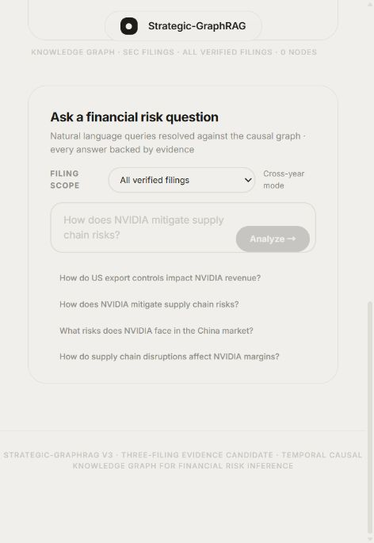

# Strategic-GraphRAG v3

Evidence-grounded GraphRAG for NVIDIA's fiscal 2023, 2024, and 2025 10-K
filings. The project turns SEC PDFs into a strict Neo4j evidence graph,
combines graph traversal with filing-scoped vector retrieval, and returns
structured answers whose citations can be joined back to verbatim PDF text.



## Verified scope

| Filing | Pages | Strict EvidenceClaims | Evidence pages | Vector chunks |
|---|---:|---:|---:|---:|
| 2023 10-K | 169 | 126 | 44 | 730 |
| 2024 10-K | 96 | 129 | 41 | 461 |
| 2025 10-K | 130 | 128 | 43 | 634 |
| **Total** | **395** | **383** | **128 filing-page pairs** | **1,825** |

The active graph has 383 strict business edges, each linked to a `VERBATIM`
EvidenceClaim with filing, page, section, chunk, source entity, target entity,
and relation metadata. All 383 claims use content-derived `claim_v2_*` IDs.
The post-migration audit found 49 valid same-filing two-hop paths and zero
invalid strict paths.

Legacy storage is now physically isolated: the post-clean check found zero
out-of-scope business edges, zero old evidence nodes, and zero old Chroma
collections. A complete local recovery archive was created before deletion but
is intentionally not committed because it contains embeddings and extracted
filing text.

## Architecture

```text
Three allowlisted 10-K PDFs
  -> page parsing and SEC section detection
  -> overlapping text chunks plus financial-table rows
  -> rules + DeepSeek Flash extraction
  -> ontology, quote/span, and entity validation
  -> Neo4j business edge + EvidenceClaim + Sentence provenance
  -> Chroma semantic chunks
  -> adaptive graph/hybrid retrieval
  -> grounded structured synthesis
  -> FastAPI + React/Vite evidence UI
```

Key implementation decisions:

- Exact metric questions route to `REPORTS_METRIC` facts rather than risk edges.
- Exploratory questions use graph + vector retrieval; explicit metric or
  ontology-relation questions can skip the vector round trip.
- Every synthesized citation is checked against the returned path evidence.
- Repeated disclosures across years are connected by 99 derived
  `NEXT_DISCLOSURE` links. These mean disclosure order only, not intensification,
  decline, or real-world causal change.
- Identical successful API requests can use a bounded TTL cache. Responses
  expose `cache.hit`, selected retrieval mode, and per-stage latency so cached
  and uncached performance are not mixed.
- An incremental planner compares PDF SHA-256 values before rebuilding. The
  current plan reports all three PDFs unchanged and `requires_rebuild=[]`.

## Demonstrated query

`Compare revenue in 2023, 2024, and 2025`

The current engine retrieves three `REPORTS_METRIC` claims and reports:

- FY2023: $26,974 million (`p.86`)
- FY2024: $60,922 million (`p.79`)
- FY2025: $130,497 million (`p.80`)

The response was grounding-verified and used one stable EvidenceClaim ID per
filing. It does not infer the causes of revenue growth from those accounting
facts alone.

## Run locally

Python 3.11 or 3.12 is recommended. Python 3.14 can emit compatibility warnings
from some LangChain/Pydantic dependencies.

```powershell
python -m venv .venv
.\.venv\Scripts\Activate.ps1
pip install -r requirements.txt
Copy-Item .env.example .env
uvicorn strategic_graphrag.api.server:app --host 127.0.0.1 --port 8000
```

Build the frontend:

```powershell
cd frontend
npm install
npm run build
```

FastAPI serves `frontend/dist` at `http://127.0.0.1:8000/`. Configure Neo4j,
DeepSeek, the active vector collection, CORS, optional API authentication, rate
limits, cache TTL, and Cross-Encoder behavior in `.env`; never commit `.env`.

## Reproducibility and checks

```powershell
python -m unittest discover -s tests -v
python -m compileall -q strategic_graphrag scripts tests
python scripts/plan_incremental_update.py `
  --manifest reports/2026-08-13_corpus_manifest.json `
  --output reports/incremental_plan.json
python scripts/audit_strict_chains.py --output reports/strict_chains.json
cd frontend
npm run build
```

The current release passed 10 focused Python contracts, Python compilation,
frontend TypeScript/Vite production build, Neo4j/Chroma post-clean checks, stable
ID consistency, strict path validation, API health, and browser rendering. The
largest JavaScript chunk is about 422 kB after splitting React, Motion,
vis-data, and vis-network.

One uncached three-year revenue request took 11.20 seconds inside the engine in
the final local check; a prior cold-start request took 13.65 seconds. A repeated
cached request returned in about 9 ms wall time. These are development-machine
observations, not benchmark guarantees.

## Research status and honest limitations

This is a strong engineering candidate, not yet a completed research result:

- Extraction precision/recall has not been measured on a human-annotated
  relation set. Page coverage is not the same as extraction recall.
- The existing 38-item auto-generated QA file is stale after the evidence-ID
  migration and is not a valid Golden QA benchmark. Per project scope, no new
  manual Golden QA was created in this release.
- The five-question end-to-end suite was not rerun after the final migration
  because sending 2023/2024 evidence to the external LLM was not authorized for
  that audit. One explicit three-year metric query and browser flow were tested.
- Filing disclosures support attributed relationships; they do not prove
  counterfactual causality, effect size, probability, or investment outcomes.
- `NEXT_DISCLOSURE` is a provenance-preserving time index, not full temporal
  reasoning. A calibrated change classifier and temporal benchmark remain open.
- API authentication is configurable but disabled in the local demo. It must be
  enabled with restricted CORS before public deployment.
- DeepSeek Flash is an external processor. Production use needs documented data
  governance, consent, retention, and provider-failure behavior.

See [the v3 engineering audit](reports/2026-08-13_v3_release_audit.md) and the
[machine-readable corpus manifest](reports/2026-08-13_corpus_manifest.json).

## Next research milestones

1. Label a stratified relation-extraction set and report entity/relation
   precision, recall, F1, and error categories.
2. Build a 30-50 question human Golden QA set with stable evidence IDs and
   unanswerable cases; report retrieval Recall@K, Precision@K, faithfulness,
   answer relevance, abstention accuracy, and latency distributions.
3. Add an evidence-grounded temporal change classifier with labels such as
   new, continued, intensified, mitigated, and resolved; evaluate it separately
   from disclosure ordering.
4. Run graph-only, vector-only, hybrid, reranker, and evidence-guard ablations.
5. Containerize and deploy behind authentication, restricted CORS, observability,
   request timeouts, and cost controls.

## License and data

Code is intended for academic and portfolio use. SEC filings, model APIs, and
third-party libraries retain their own licenses and terms. PDFs, vector stores,
credentials, and large local audit archives are excluded from Git.
