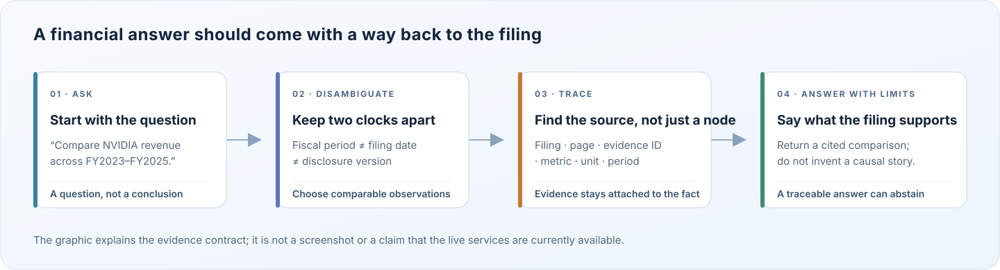
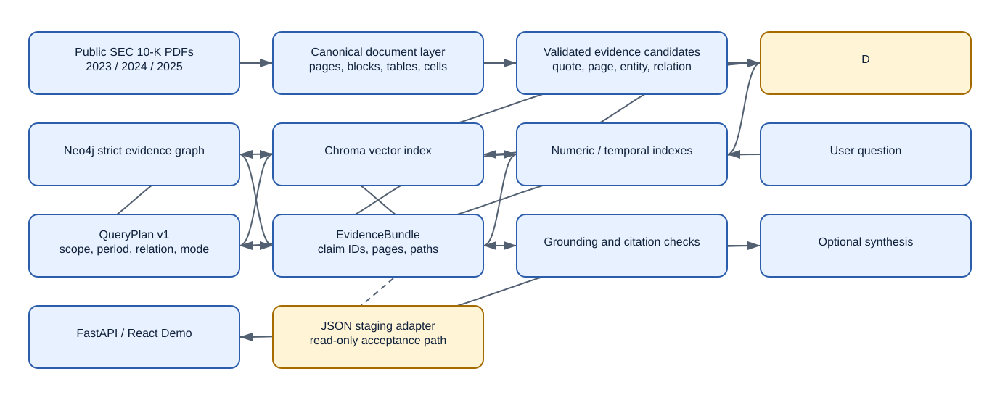

<p align="center">
  
</p>

<h1 align="center">Strategic-GraphRAG</h1>

<p align="center"><strong>Financial answers you can trace back to the filing.</strong><br />A research prototype for evidence-grounded questions about NVIDIA’s FY2023–FY2025 SEC filings.</p>

> **Scope boundary:** the cross-year example and retrieval experiment below come from an isolated three-filing candidate. The checked-in `.env.example` still selects only the 2025 filing by default; a fresh clone does not recreate the candidate corpus or its database/vector stores.

<p align="center">
  <a href="https://github.com/luoge850-lang/Strategic-GraphRAG/actions/workflows/ci.yml?query=branch%3Astable"></a>
  <a href="https://github.com/luoge850-lang/Strategic-GraphRAG/pull/1"></a>
</p>

> This is an experimental research and engineering project—not financial advice, an investment tool, a causal-identification system, or a production-ready service.

## Why this project exists

A reported value has more than one date attached to it. **The fiscal period** says when the business result occurred; **the filing version** says when and where it was disclosed. A later filing may repeat earlier years, and a graph that forgets this distinction can make two numbers look comparable when they are not.

Strategic-GraphRAG keeps the question, typed financial observation, filing version, source page, and evidence identifier connected. The goal is not to make every answer sound confident. The goal is to make a supported answer inspectable—and to make ambiguity or missing evidence visible.

<p align="center">
  
</p>

The diagram describes the candidate design, including its staging boundary. It does **not** imply that the real Neo4j, Chroma, or browser path has passed end-to-end validation.

## One question, one evidence trail

Consider: **“Compare NVIDIA revenue for FY2023, FY2024, and FY2025 using the same disclosure.”** In the isolated candidate run, all three observations came from the *Total revenue* row in NVIDIA’s 2025 Form 10-K, physical PDF page 80:

| Fiscal period | Revenue | Disclosure and location |
|---|---:|---|
| FY2023 | USD 26,974 million | 2025 Form 10-K · PDF p. 80 |
| FY2024 | USD 60,922 million | 2025 Form 10-K · PDF p. 80 |
| FY2025 | USD 130,497 million | 2025 Form 10-K · PDF p. 80 |

The deterministic calculation marked this narrow comparison `CONDITIONALLY_COMPARABLE`. That means the values were selected from the same disclosed row and unit; it is not a full audit of accounting-policy changes, a claim about why revenue changed, or proof of causality. See the [candidate repair and delivery record](https://github.com/luoge850-lang/Strategic-GraphRAG/blob/9270c3bff269e67e0eea80788be7139379390ea7/docs/financial_qa_candidate_repair_delivery_2026-09-29.md) for the source checks and failure history. The original filing PDFs are not redistributed in this repository.

## What the latest experiment actually says

The source-matched candidate replay is useful mainly because it challenges the assumption that graph expansion must help. On this small development slice, **fusion without graph expansion beat fusion with graph expansion on the annotated-page hit measure**: 5/23 versus 1/23. Adding a time constraint changed the result, but the no-graph time-filtered diagnostic was still higher: 16/23 versus 13/23 for graph-plus-time. These are descriptive development results, not independent test accuracy or proof that one method is universally better.

The speed trade-off is also visible: keyword retrieval had a 3.370 ms median query time, while methods that performed local semantic embedding were around 140–146 ms in this run. That is retrieval-stage timing under the recorded single-concurrency setup—not end-to-end user latency. The paired semantic-family intervals crossed zero; this run does not establish a statistically reliable winner.

<details>
<summary>Open the complete retrieval comparison and measurement limits</summary>

The six methods used the same isolated 843-chunk candidate, 26 question forms, 20 semantic families, and a 10-page output budget. The run made 156/156 retrieval calls. Direct-support labels were available for 23 question forms across 17 families; 30 relevant page judgments were explicit. The label pool was not exhaustive, so these counts are **annotated-support-page hits**, not full-corpus Recall@10. nDCG was not calculated because unjudged pages must not be treated as irrelevant.

| 检索方法 | 已标注支持页命中请求 | 家族等权命中率 | 家族等权 MRR@10 | 查询延迟 p50 / p95（毫秒） |
|---|---:|---:|---:|---:|
| 关键词检索（BM25） | 11/23 | 0.4118 | 0.2348 | 3.370 / 4.695 |
| 语义向量检索 | 1/23 | 0.0588 | 0.0294 | 140.770 / 152.827 |
| 关键词与语义融合检索（倒数排名融合） | 5/23 | 0.1765 | 0.0878 | 145.078 / 157.411 |
| 融合检索＋知识图谱扩展 | 1/23 | 0.0588 | 0.0294 | 143.373 / 150.465 |
| 融合检索＋知识图谱扩展＋时间约束 | 13/23 | 0.4706 | 0.1687 | 146.024 / 158.471 |
| 融合检索＋时间约束（无图扩展诊断对照） | 16/23 | 0.6176 | 0.2493 | 144.026 / 152.922 |

The family-level 95% bootstrap intervals are descriptive only (17 families, 2,000 resamples) and are not a substitute for a sufficiently powered independent test. Answer generation was disabled. Human Gold labels, answer/citation accuracy, nDCG, cold-start timing and concurrency 2/4 were not measured in this retrieval replay. The separate local browser inspection below is not candidate-store acceptance.

**Reproduction inputs:** the [raw retrieval records](https://github.com/luoge850-lang/Strategic-GraphRAG/blob/9270c3bff269e67e0eea80788be7139379390ea7/experiments/financial-evidence-qa-2026-09-29-calculation-contract/financial_retrieval_raw_20260930_build_7feb21b48e594a7a.jsonl), [recomputed summary](https://github.com/luoge850-lang/Strategic-GraphRAG/blob/9270c3bff269e67e0eea80788be7139379390ea7/experiments/financial-evidence-qa-2026-09-29-calculation-contract/financial_retrieval_summary_20260930_build_7feb21b48e594a7a.json), and [chart](https://github.com/luoge850-lang/Strategic-GraphRAG/blob/9270c3bff269e67e0eea80788be7139379390ea7/experiments/financial-evidence-qa-2026-09-29-calculation-contract/financial_retrieval_summary_20260930_build_7feb21b48e594a7a.png) are pinned to candidate source commit `9270c3b`. The candidate PR is separate from `stable`; its results are not stable-runtime measurements.

From the candidate branch, with the recorded inputs available and **new, unused output paths**, the summary and chart can be regenerated with:

```powershell
python scripts\summarize_financial_candidate_run.py `
  --raw experiments\financial-evidence-qa-2026-09-29-calculation-contract\financial_retrieval_raw_20260930_build_7feb21b48e594a7a.jsonl `
  --table-audit experiments\financial-evidence-qa-2026-09-28\table_quality_ai_visual_diagnostic_2026-09-24_v2.jsonl `
  --dataset experiments\financial-evidence-qa-2026-09-28\financial_qa_dev_source_review_20260924_v3.jsonl `
  --output experiments\financial-evidence-qa-2026-09-29-calculation-contract\summary_recomputed.json `
  --chart experiments\financial-evidence-qa-2026-09-29-calculation-contract\summary_recomputed.png
```

</details>

## Two snapshots, kept separate

The numbers below describe different artifacts and should not be combined into one scorecard.

| Historical `stable` runtime snapshot | Isolated research candidate in [PR #1](https://github.com/luoge850-lang/Strategic-GraphRAG/pull/1) |
|---|---|
| 383 strict evidence claims; 1,686 vector chunks; 49 valid same-filing two-hop paths in the recorded post-clean audit. These are inventory/provenance checks, not answer accuracy. | Build `build_7feb21b48e594a7a`; 395 parsed pages; 843 vector chunks; 198 accepted triples, expanded into 362 fact edges. These counts describe distinct layers. |
| Historical stable query and system snapshot. | Package integrity and deterministic engineering acceptance each passed 8/8; retrieval completed 156/156 calls. None of these is an independent answer-quality score. |

The candidate calculation contract now rejects conflicting observations, unsupported operations, missing periods, currency/scale mismatches, zero denominators, and non-finite results rather than silently returning a plausible-looking value. The full [repair record](https://github.com/luoge850-lang/Strategic-GraphRAG/blob/9270c3bff269e67e0eea80788be7139379390ea7/docs/financial_qa_candidate_repair_delivery_2026-09-29.md) includes before/after cases and regression evidence.

## Run the local application

This starts the application code; it does **not** download the licensed filing PDFs, restore a Neo4j database, or populate a Chroma collection. A new checkout needs compatible data and indexes before real financial queries can pass readiness. See [`data/README.md`](data/README.md) for corpus acquisition notes and verify the documented file hashes before use.

The checked-in `.env.example` currently selects one active 2025 filing and a default external model provider. Review it before running; set your own Neo4j, collection, model-provider, and authentication values in a local `.env`, and never commit secrets. A local LLM provider can avoid sending query text to an external provider, but it still needs to be installed and configured separately.

```powershell
python -m venv .venv
.\.venv\Scripts\Activate.ps1
python -m pip install --upgrade pip
pip install -r requirements-hybrid.txt
Copy-Item .env.example .env
python -m uvicorn strategic_graphrag.api.server:app --host 127.0.0.1 --port 8000
```

In a second terminal, run the frontend development server:

```powershell
cd frontend
npm ci
npm run dev -- --host 127.0.0.1
```

Open `http://127.0.0.1:5173/`. Check process liveness at `http://127.0.0.1:8000/health/live` and configured dependency readiness at `http://127.0.0.1:8000/health/ready`. A live process or HTTP 200 from the liveness endpoint does not mean Neo4j, vectors, or the query path are ready.

## What is—and is not—validated

**Recorded engineering evidence:** build identity and immutable package checks for the candidate; deterministic calculation regressions; source-page and provenance checks; and the fixed development retrieval replay described above.

**Actual local demo:** five real HTTP queries executed, but only **1/5 scenario assertions passed**. The browser displayed the FY2025 revenue evidence and clicking its citation opened the original PDF at physical page 80. The numeric calculation correctly refused unbound legacy observations; it did not produce a validated answer. Readiness returned HTTP 503 after a dependency-probe timeout.

**Still open:** independent human-reviewed answer quality; exhaustive relevance labels and full-corpus recall; dedicated real Neo4j/Chroma candidate import and build isolation; complete numeric browser acceptance; restart, recovery and rollback against those services; and authenticated HTTPS deployment. No server or domain has been provisioned.

<details>
<summary>See the actual browser captures and public-demo release gates</summary>

The query capture shows source evidence **and** `INSUFFICIENT_EVIDENCE`, not a successful financial answer. The second image is the PDF opened by clicking the real citation. Both belong to the legacy-store run, separate from the isolated candidate experiment.


[Raw responses, counts and recomputation](https://github.com/luoge850-lang/Strategic-GraphRAG/blob/d0758c3aab9be05a9e8581395dac450f62e69f42/experiments/public-demo-delivery-2026-09-30/README.md) · [Protected public-demo deployment recipe](https://github.com/luoge850-lang/Strategic-GraphRAG/blob/d0758c3aab9be05a9e8581395dac450f62e69f42/deployment/README.md)

</details>

This prototype reports relationships stated in filings. Co-occurrence, a graph path, or an increase over time is not evidence that one event caused another. Do not use its outputs as investment advice.

## Where research should go next

1. **Establish answer truth independently.** Review the 60 table candidates against source PDFs, record each field and joint-fact decision, then have a second reviewer resolve disagreements. Split new questions by semantic family before tuning and freeze a test set.
2. **Test when graph expansion earns its cost.** The current point estimates favor the no-graph diagnostic on this slice. Run a predeclared, family-paired test on relationship and conditional-risk questions; record relevant evidence added, irrelevant evidence added, and correct evidence displaced. Keep a negative result if expansion does not help.
3. **Validate the real deployment path.** Rebuild into a new build-scoped Neo4j/Chroma namespace, verify counts, source hashes, and version isolation, then complete API, browser citation, restart, failure, and rollback checks before calling the system stable.

## Reproducibility and data

- CI compiles Python and runs focused contract tests; the frontend is built with the checked-in `frontend/package-lock.json`.
- The Python requirements currently use version ranges rather than a fully hash-pinned environment lock. A fresh install is therefore not guaranteed to reproduce the original machine byte-for-byte.
- PDFs, database files, embeddings, local environment files, and recovery archives are not committed. Obtain source filings only under their applicable terms and verify SHA-256 values from the candidate report before rebuilding.
- The candidate report records the exact inputs, dataset/protocol caveats, hardware and timing conditions, failed runs, and commands. The history contains both successful and failed evidence; do not replace it with only the latest favorable run.

## License and use

Code is intended for academic and portfolio use. SEC filings, model APIs, and third-party packages remain subject to their own terms. Do not upload credentials, local database copies, full caches, or private filing archives.
