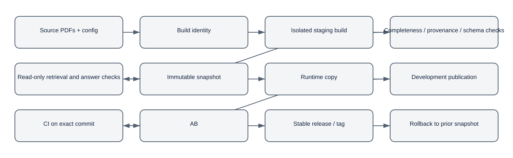

# Strategic-GraphRAG

<div align="center">
  <p><strong>Evidence-first financial retrieval over NVIDIA SEC filings</strong></p>
  <p>
    <a href="https://github.com/luoge850-lang/Strategic-GraphRAG/actions/workflows/ci.yml"></a>
    &nbsp;·&nbsp; Research and engineering prototype
  </p>
  
  <p><sub>Filing-scoped retrieval, evidence contracts, and an explicit publication boundary.</sub></p>
</div>

Strategic-GraphRAG is a research-oriented retrieval system for tracing
financial disclosures in NVIDIA fiscal 2023–2025 SEC 10-K filings. It combines
a strict evidence graph, filing-scoped vector retrieval, temporal filters, and
an evidence-aware answer contract. It is an engineering/research prototype,
not an investment adviser, causal-identification system, or production service.

**Development runtime inventory:** 381 strict `EvidenceClaim` records and
1,686 vector chunks. This inventory is distinct from the isolated staging
package below; inventory counts are not parser or answer-accuracy evidence.

## Status at a glance

The GitHub default branch is `stable`. This checkout is the development branch
`codex/v3-three-filing-evidence-graphrag`; its metrics must not be mixed with
the stable release. The current development acceptance boundary is:

| Gate | Status | Meaning |
|---|---|---|
| Reproducible experiment candidate | `LIMITED PASS` | Candidate `build_f74bb1dfbf96b8a2` ran the frozen v4 offline retrieval matrix: 156/156 scheduled retrieval calls succeeded across six methods. Labels are AI/PDF development diagnostics, not human Gold or an independent test; answer quality was not run. |
| Engineering stable | `BLOCKED` | The restarted live service became ready, but active Neo4j/Chroma data are not bound to the candidate build. A build-scoped observation dry run found 0 eligible claims/observations; no shadow import or cutover occurred. Four in-scope browser queries returned incomplete evidence rather than completed calculations/comparisons, and PDF click-through is blocked by the local browser (`ERR_BLOCKED_BY_CLIENT`). Recovery, timeout, rollback, security and load acceptance remain incomplete. |
| Production candidate | `NOT_RUN` | Security, monitoring, backup/rollback, SLO, cost, and production failure/load tests are not accepted. |

See the [historical acceptance ledger](docs/acceptance_ledger_2026-09-21.md), the
[public claim ledger](docs/claim_ledger.md), and the
[version strategy](docs/version_strategy_2026-09-22.md). The working-tree
decisions are recorded in the [delivery cleanup manifest](docs/delivery_cleanup_manifest.md).
The latest frozen protocol, raw records, recomputable summary, chart, live
service observations, and limitations are in the
[2026-09-28 candidate report](docs/financial_qa_candidate_release_2026-09-28.md)
and its [selective public experiment bundle](experiments/financial-evidence-qa-2026-09-28/README.md).

### Current isolated delivery

The `published_pointer.json` still points to `build_0be5c1b2939c6583`, whose
artifact hash verification fails; it has deliberately not been changed. The
latest **unpublished** experiment candidate is
`build_f74bb1dfbf96b8a2` (source fingerprint, protocol, dependency lock, and
PDF hashes are recorded in the handoff report). It contains 395 PDF pages,
843 chunks, 198 accepted triples, and 362 expanded fact edges. Package
identity/hash verification and same-build resume passed. The current offline
suite reports 203 passed, 2 warnings, and 7 subtests passed; the v4 six-method
retrieval matrix completed 156/156 requests. This does not establish
independent QA accuracy or a stable release.

The v4 experiment contains 20 semantic families and 26 question forms. Six
retrieval methods share one candidate package and a maximum final evidence
budget of ten physical pages. It completed 156/156 scheduled retrieval calls
in 27.033 seconds serially, including setup. Only 23 question forms from 17
families have AI/PDF-checked direct-support pages (30 judged page instances);
the page judgments are non-exhaustive. Full-corpus Recall and nDCG are not
claimed. Numeric-answer, full-fact, citation, locator, and abstention quality
were not scored because answer generation was disabled. Details and the exact
recompute command are in the linked candidate report and bundle.

The source-reviewed development diagnostic shows direct-support hit@10 of
11/23 for 关键词检索（BM25）, 1/23 for 语义向量检索, 5/23 for 关键词与语义融合检索（倒数排名融合）,
1/23 for 融合检索＋知识图谱扩展, 13/23 for 融合检索＋知识图谱扩展＋时间约束, and
16/23 for 融合检索＋时间约束（无图扩展诊断对照）. These are not independent
accuracy scores; graph expansion did not improve the paired development hit
diagnostics, and the intervals are wide and include zero.

After the user started Neo4j, the live service returned a single-year FY2025
revenue evidence path. The cross-disclosure comparison returned only one
filing; growth and unit-conversion questions returned evidence but no computed
answer. An out-of-corpus FY2026 question abstained. The API serves the cited
PDF with HTTP 200, but the in-app browser refused to render the local PDF
(`ERR_BLOCKED_BY_CLIENT`). These trials establish neither answer accuracy nor
end-to-end citation acceptance. The active Chroma collection has 1,686 items
and null `build_id`, while the isolated candidate has 843 chunks; no live
store was modified and the release pointer was not changed.

The Python 3.12 locked clean-install and offline tests were previously checked
in a temporary environment. Current offline suite result is 203 passed, 2
warnings, and 7 subtests passed. Frontend production build succeeds. Live
recovery/rollback, dependency-timeout, browser PDF rendering, concurrency,
security, and production load acceptance remain incomplete.

## Verified development snapshot

| Filing | Physical pages | Strict EvidenceClaims | Vector chunks |
|---|---:|---:|---:|
| 2023 10-K | 169 | 126 | 678 |
| 2024 10-K | 96 | 129 | 425 |
| 2025 10-K | 130 | 126 | 583 |
| **Total** | **395** | **381** | **1,686** |

These 381 claims and 1,686 chunks describe the separate existing development
runtime inventory; the corrected isolated package has a different graph and
vector build with its own manifest and identity. The public
`stable` branch contains a different historical snapshot; do not combine its
383-claim inventory with this table. Raw PDFs, Chroma files, Neo4j data, and
external-model response caches are local/generated assets and are not shipped
in this repository. Their acquisition and hash boundary are described in
[`data/README.md`](data/README.md) and the
[reproducibility freeze](docs/reproducibility_freeze_2026-09-18.md).

## What is implemented

- Canonical page, text-block, table, and cell records with page-conservation
  and fail-closed parse statuses.
- Validated `EvidenceClaim` records with quote, page, filing, entity, relation,
  and claim-ID provenance.
- 支持知识图谱检索、语义向量检索、关键词与语义融合检索、融合检索＋时间约束，
  以及融合检索＋知识图谱扩展。
- Filing scope, fact-period parsing, directed path search, bounded PPR anchor
  expansion, temporal fact filters, and structured response contracts.
- Evidence variants are merged by semantic path before ranking. Explicit
  structural relations require endpoint alignment and direct predicate support;
  `includes`, `runs on`, and `based on` remain background evidence.
- A bounded process-local PPR cache and separate `anchor_resolution_ms` /
  `ppr_ms` telemetry for repeated Graph/Hybrid requests.
- A local React/Vite Demo and a click-to-run Windows launcher. The launcher
  waits for `/health/ready` and does **not** configure boot-time auto-start.

The system architecture is shown above. The offline publication path is also
available as a diagram:

<details>
<summary>View the isolated publication pipeline</summary>



</details>

Editable Mermaid sources:

- [`docs/diagrams/architecture.mmd`](docs/diagrams/architecture.mmd)
- [`docs/diagrams/publication_pipeline.mmd`](docs/diagrams/publication_pipeline.mmd)

The dated runtime verification record is
[`docs/visual_verification_2026-09-23.md`](docs/visual_verification_2026-09-23.md).
It documents a computer-use check that observed 134 graph nodes, 381 edges,
and 10 entity types, plus an evidence-trace query that failed closed and a
reasonable abstention. The graph and external services are not shipped in Git,
so this runtime state is not a reproducible repository asset. The older
`0 NODES` bitmap is intentionally excluded; release screenshots should identify
their commit, build ID, data scope, and `live`/`replay` status.

## Evidence-traceable example

Question: `Compare revenue in 2023, 2024, and 2025`.

This cross-year example is not currently accepted as a successful live
comparison: the 2026-09-28 browser trial returned an incomplete set of
disclosure versions. The intended answer contract treats accounting disclosure
as disclosure; it does not infer why revenue changed or claim a counterfactual
causal effect. See the [live trial record](experiments/financial-evidence-qa-2026-09-28/live_browser_trials.json)
for the observed output and the current PDF click-through limitation.

## Retrieval results and evidence limits

The latest v4 AI/PDF source-review development diagnostic is in
[`experiments/financial-evidence-qa-2026-09-28/`](experiments/financial-evidence-qa-2026-09-28/).
It reports hit rate only against explicitly judged direct-support pages, not
full-corpus recall. Its label pool is incomplete and was used during
development; do not treat it as a held-out test or answer-accuracy result.

| 完整中文方法名称 | 已标注直接支持页命中@10 | 命中请求分母 | 请求延迟 p50 / p95（毫秒） |
|---|---:|---:|---:|
| 关键词检索（BM25） | 11/30 页 | 11/23 | 4.297 / 5.472 |
| 语义向量检索 | 1/30 页 | 1/23 | 190.141 / 228.711 |
| 关键词与语义融合检索（倒数排名融合） | 5/30 页 | 5/23 | 193.703 / 226.350 |
| 融合检索＋知识图谱扩展 | 1/30 页 | 1/23 | 193.156 / 226.452 |
| 融合检索＋知识图谱扩展＋时间约束 | 14/30 页 | 13/23 | 194.319 / 225.599 |
| 融合检索＋时间约束（无图扩展诊断对照） | 18/30 页 | 16/23 | 190.959 / 233.387 |


A 2026-09-29 run through the unified validation script reproduced the same
per-method direct-support hit counts (156/156 requests succeeded), while
p95 latency varied across runs. The supplemental raw run is kept separately
under `repeat_20260929/`; it is not an independent test and its latency is not
pooled with the primary run. See the [release report](docs/financial_qa_candidate_release_2026-09-28.md)
for both timing tables and the protocol deviation disclosure.

The 30-page denominator is the explicitly judged direct-support page pool; it
is not exhaustive and is not full-corpus Recall@10. nDCG was not computed.
The values above are development diagnostics, not human-reviewed accuracy.

### Historical graph-derived Silver regression

The separate historical Silver regression contains 37 automatically generated questions,
with 32 answerable and 5 abstention-required. The page-level development
snapshot is summarized in [public results](docs/public_results_2026-09-22.md):

| 完整中文方法名称 | Precision@5 | Recall@5 | nDCG@5 | MRR |
|---|---:|---:|---:|---:|
| 语义向量检索 | 0.0500 | 0.2188 | 0.1103 | 0.0828 |
| 知识图谱检索 | 0.2313 | 0.8259 | 0.8079 | 0.8073 |
| 混合检索 | 0.2313 | 0.8259 | 0.7733 | 0.7604 |
| 混合检索＋时间约束 | 0.2250 | 0.7946 | 0.7577 | 0.7500 |

These are retrieval metrics on graph-derived Silver labels, not answer
accuracy and not independent human gold. They support only the narrow
observation that 知识图谱检索 scored higher than 语义向量检索 on this
snapshot. They do not prove that graph retrieval is generally superior to
vector retrieval, and 混合检索＋时间约束 is not the global winner in this
run.

## Quick start

### Offline checks without external services

Create the locked Python 3.12 environment and install dependencies:

```powershell
py -3.12 -m venv .venv
.\.venv\Scripts\python.exe -m pip install -r requirements-lock-2026-09-19.txt
```

Then run tests and static checks:

```powershell
.\.venv\Scripts\python.exe -m pytest -q
.\.venv\Scripts\python.exe -m compileall -q strategic_graphrag scripts tests
git diff --check
```

The current local environment is expected to be Python 3.12 with versions in
[`requirements-lock-2026-09-19.txt`](requirements-lock-2026-09-19.txt). The lock
was installed in a fresh temporary Python 3.12 environment on 2026-09-24 and
the offline test suite passed there; this does not imply a clean end-to-end
Neo4j/API/browser deployment acceptance.

### Real Neo4j/Chroma Demo

1. Obtain the three public 10-K PDFs from SEC EDGAR or the official company
   filing pages. Do not commit them to this repository.
2. Create `.env` from [`.env.example`](.env.example). Configure the current
   Neo4j Aura URI/database, DeepSeek credentials/model, and the active Chroma
   collection. Never commit `.env`.
3. Prepare the vector and graph stores using the explicit migration scripts;
   migrations write to external stores and are not part of ordinary checks.
4. Build the frontend:

   ```powershell
   cd frontend
   npm ci
   npm run build
   cd ..
   ```

5. After entering Codex or opening a terminal, double-click `open_demo.cmd`,
   or run:

   ```powershell
   .\scripts\open_demo.ps1
   ```

   The script starts the local API only when needed, waits for Neo4j, Chroma,
   and the configured LLM to report ready, and then opens
   `http://127.0.0.1:8000/`. It does not install a Windows startup task.
6. For a controlled restart only:

   ```powershell
   .\scripts\open_demo.ps1 -Restart
   ```

If `/health/live` is available but `/health/ready` is not, the API process is
running but an external dependency is not ready. Check that the Aura database
is running and copy its current Connect URI/database name into `.env`; the
database instance ID alone is not a connection URI.

### Optional model generation

Retrieval-only evaluation disables synthesis and external LLM anchor expansion
for comparability. Answer synthesis is optional and must be reported in a
separate run with model, prompt, temperature, cache mode, and failure counts.

## Evaluation and reproduction

The evaluation protocol defines units and denominators for page-level,
sentence-level, EvidenceClaim-level, primary-evidence, answer, citation, and
abstention metrics:
[`docs/research_evaluation_protocol.md`](docs/research_evaluation_protocol.md).

```powershell
# Readiness audit; fail-closed and read-only
.\.venv\Scripts\python.exe scripts/audit_research_readiness.py

# Legacy retrieval-benchmark CLI
.\.venv\Scripts\python.exe scripts/evaluate_retrieval_benchmark.py --help

# Runtime smoke profiling; cache miss is not process cold start
.\.venv\Scripts\python.exe scripts/benchmark_runtime_performance.py `
  --base-url http://127.0.0.1:8000 --limit 4 --concurrency 1

# Table-quality Gold candidate annotation
.\.venv\Scripts\python.exe scripts/export_table_annotation_queue.py --help
.\.venv\Scripts\python.exe scripts/evaluate_table_quality.py --help
```

### Frozen v4 development diagnostic

One command runs the offline suite, verifies the matching immutable local
candidate package, executes the six-method matrix, and writes a new raw run,
manifest, summary, and chart. The three PDFs and generated build must already
exist locally with the hashes in the run manifest; the command fails closed
when a required input is absent.

```powershell
.\scripts\validate_financial_qa_candidate.ps1 -PythonExe ".\.venv\Scripts\python.exe"
```

The checked-in raw output can be re-scored and its chart regenerated without
calling a model or a live database:

```powershell
.\.venv\Scripts\python.exe scripts/summarize_financial_candidate_run.py `
  --raw experiments\financial-evidence-qa-2026-09-28\financial_retrieval_raw_20260928-dev20-final-v4.jsonl `
  --dataset experiments\financial-evidence-qa-2026-09-28\financial_qa_dev_source_review_20260924_v3.jsonl `
  --table-audit experiments\financial-evidence-qa-2026-09-28\table_quality_ai_visual_diagnostic_2026-09-24_v2.jsonl `
  --output reports\evaluation\recomputed_summary.json `
  --chart reports\evaluation\recomputed_summary.png
```

To rerun retrieval rather than only recompute metrics, acquire the three PDFs
and build a local package whose build ID and source fingerprint match the run
manifest. The immutable candidate package and PDFs are not distributed on
GitHub; a clean checkout alone cannot rerun retrieval. See
`scripts/run_financial_retrieval_matrix.py --help` for runner options.

Do not run commands with `--apply` against the active graph during ordinary
review. Active-store writes require an isolated database, a new immutable
build identity, completeness checks, and a rollback plan.

## Evaluation boundaries

- `VERBATIM` means the stored quote matches the declared source location. It
  is not a semantic truth label.
- The 30-row answer-level Golden QA is complete as a one-reviewer engineering
  checkpoint, not as independent two-reviewer paper gold.
- The 60-row table-quality queue has an AI/PDF visual diagnostic, not human
  annotation; primary review, independent secondary review, and adjudication
  remain `NOT_RUN`.
- The current Silver expected evidence is derived from the graph under test;
  its scores are regression proxies with self-test bias.
- An overall answer-accuracy percentage is `NOT_RUN`. The 8/8 isolated
  acceptance cases exercise contracts and dependency failure handling; they
  are not an independently labeled accuracy sample. Historical retrieval and
  single-filing LLM-judge scores remain scoped to their own datasets and are
  not transferable to the current three-filing package.
- The saved 37-case auto-Silver retrieval regression reports Graph
  Precision@5 `0.2313`, Recall@5 `0.8259`, nDCG@5 `0.8079`, and MRR `0.8073`.
  These are retrieval metrics against graph-derived labels, not answer
  accuracy; the tracked summary is
  [`docs/public_results_2026-09-22.md`](docs/public_results_2026-09-22.md),
  while row-level reports remain local and Git-ignored.
- Fresh external-model extraction has produced different accepted-output
  counts under nominally fixed settings. Cached record/replay is deterministic
  for the recorded responses, but the readiness gate remains `NOT_READY`.
- Disclosed relationships are attributed to the filing. Graph paths do not
  prove counterfactual causality, effect sizes, investment outcomes, or future
  performance.
- The 12-page Docling conversion pilot is complete as a `REVIEW_REQUIRED`
  comparison, with original-page review material; semantic parser replacement
  remains unaccepted until independent human review.
- Clean end-to-end service deployment, live Neo4j version-bound observation
  migration and calculation acceptance, production adapters, full
  formal ablations, production load, cost, monitoring, and security remain
  unaccepted.

## Repository map

| Path | Role |
|---|---|
| `strategic_graphrag/` | Runtime, contracts, extraction, retrieval, schema |
| `frontend/` | React/Vite Demo |
| `evaluation/` | Versioned Silver, Golden QA, and table candidate inputs |
| `scripts/` | Build, audit, benchmark, launcher, and preparation commands |
| `docs/` | Protocols, ledgers, current status, diagrams, and historical records |
| `tests/` | Offline regression and contract tests |
| `archive/` | Local recovery material; ignored and not a public source artifact |

## License and data

No code license has been selected in this repository. Do not infer an open
source license from GitHub visibility. The SEC filings, model weights, APIs,
and third-party datasets have their own terms. See [data/README.md](data/README.md)
and [data/external/README.md](data/external/README.md) before redistribution.
