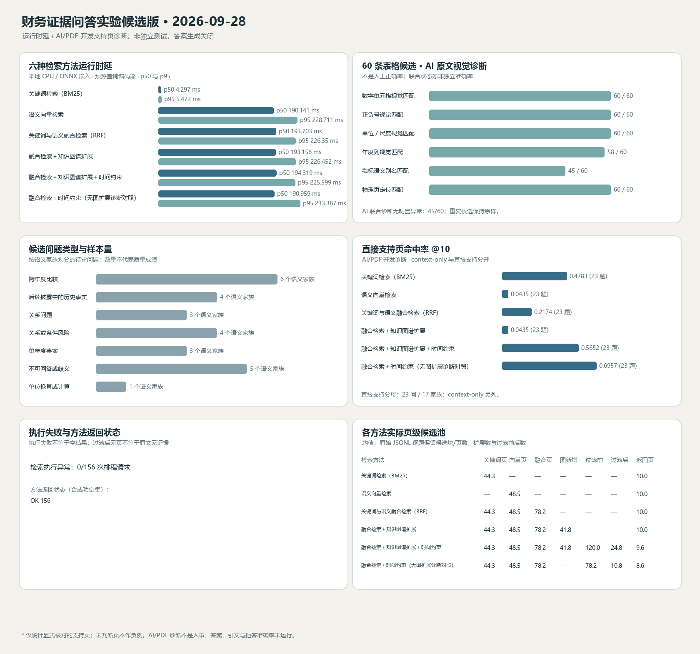

# 财务证据问答候选版交付记录 — 2026-09-28

## 发布结论

**当前等级：可复现的离线检索实验候选版（范围受限）。不是已通过真实服务验收的工程稳定候选版，也不是生产版本。**

可复核的最高强度结论是：候选构建 `build_f74bb1dfbf96b8a2` 上，六种检索配置共排程 156 次离线检索，156 次成功；其中只有 23 个问句形式、17 个语义家族有 AI/PDF 核对的直接支持页标签，标签只覆盖明确列出的 30 个页实例，不是穷尽相关性标注。回答生成关闭，因此答案、引用、拒答和定位准确率均未测。

原始工件、冻结协议、图表和逐题记录位于 [`experiments/financial-evidence-qa-2026-09-28/`](../experiments/financial-evidence-qa-2026-09-28/README.md)。该目录可从原始 JSONL 重算汇总，但检索矩阵本身依赖未公开的 PDF 与不可变候选包；公开仓库的干净 checkout 不能独立重跑检索。

## 实际结果

| 完整中文方法名称 | 直接支持页命中请求 / 23 | 已标注直接支持页命中 / 30 | MRR（已标注页） | 家族等权命中率 95% CI（17 家族） | 查询 p50 / p95 毫秒 |
|---|---:|---:|---:|---:|---:|
| 关键词检索（BM25） | 11/23（47.8%） | 11/30（36.7%） | 0.2348 | 20.6%–61.8% | 4.297 / 5.472 |
| 语义向量检索 | 1/23（4.3%） | 1/30（3.3%） | 0.0294 | 0%–17.7% | 190.141 / 228.711 |
| 关键词与语义融合检索（倒数排名融合） | 5/23（21.7%） | 5/30（16.7%） | 0.0878 | 2.9%–35.3% | 193.703 / 226.350 |
| 融合检索＋知识图谱扩展 | 1/23（4.3%） | 1/30（3.3%） | 0.0294 | 0%–17.7% | 193.156 / 226.452 |
| 融合检索＋知识图谱扩展＋时间约束 | 13/23（56.5%） | 14/30（46.7%） | 0.1687 | 26.5%–70.6% | 194.319 / 225.599 |
| 融合检索＋时间约束（无图扩展诊断对照） | 16/23（69.6%） | 18/30（60.0%） | 0.2493 | 38.2%–82.4% | 190.959 / 233.387 |

命中率分母为 23 个有直接支持页判断的问句形式；页分母为这些标签显式列出的 30 个直接支持页。**两者均不是完整语料 Recall@10**，未判断页面不是负例。MRR 只针对首个显式标注的直接支持页。相关性池不完整，因此 nDCG 未计算。另有 2 个问句/家族只有上下文标签，未混入直接支持指标；1 个问句/家族没有正页判断，也不计作零分。



按 17 个家族等权的配对开发诊断：

- 融合检索＋知识图谱扩展相对关键词与语义融合检索（倒数排名融合）的直接支持页命中@10 差值为 `-0.1176`，描述性家族 bootstrap 95% 区间 `[-0.3235, 0.0882]`。
- 融合检索＋知识图谱扩展＋时间约束相对融合检索＋时间约束（无图扩展诊断对照）的差值为 `-0.1471`，区间 `[-0.4118, 0.1471]`。
- 两个区间都跨越 0，且图扩展与无图对照的候选池构造不同。该小样本、开发集诊断不能证明图扩展有效或无效；本轮未观察到图方法带来的正向净收益证据。

### 题型与事实年度切片

以下为融合检索＋时间约束（无图扩展诊断对照）的直接支持页命中@10。区间按语义家族等权、2000 次 bootstrap；极小样本切片只用于定位失败方向。

| 题型 | 命中问句 / 有标签问句 | 家族数 | 家族等权命中率 95% CI |
|---|---:|---:|---:|
| 跨年度比较 | 5/6 | 6 | 50%–100% |
| 后续披露中的历史事实年度 | 4/4 | 4 | 100%–100% |
| 关系问题 | 1/3 | 3 | 0%–100% |
| 关系/条件风险 | 0/2 | 2 | 0%–0% |
| 单年度事实 | 2/3 | 3 | 0%–100% |
| 不可回答/歧义题的检索支持页诊断 | 3/4 | 4 | 25%–100% |
| 单位转换/计算 | 1/1 | 1 | 100%–100% |

按事实年度（切片会重叠）：FY2022 为 9/10（6 家族，CI 50%–100%）；FY2023 为 6/8（8 家族，37.5%–100%）；FY2024 为 3/3（3 家族，100%–100%）；FY2025 为 4/9（8 家族，12.5%–75%）。这些是检索支持页命中，不可解释为对应题型的答案准确率；不可回答/歧义题的页命中也不是拒答表现。

每个方法的所有题型/事实年度分子、分母及区间保存在 `financial_qa_summary_20260928-dev20-final-v4.json`，可由本目录原始运行记录重算。

### 速度与资源

- 运行环境：Windows 11 `10.0.26100`，Python `3.12.14`，16 个逻辑 CPU，系统内存 `16,961,822,720` 字节；本轮未留存可验证的 CPU/GPU 型号和物理核数。
- 首轮进程峰值 RSS：`314,011,648` 字节（约 299.5 MiB）；9 月 29 日复测峰值为 `324,243,456` 字节（约 309.2 MiB）。两次均并发 1、结果缓存关闭，查询嵌入为本地 `all-MiniLM-L6-v2` ONNX；预热分别约 `0.490` 秒和 `0.492` 秒，不计入逐请求延迟。
- 156 次串行请求总墙钟时间 `27.033` 秒，含初始化与查询；吞吐 `5.771` 次/秒也是含初始化的总量口径。各方法 p50/p95 基于 26 次成功请求。
- 冷启动耗时、并发 2/4、真实 HTTP 端到端延迟、磁盘 I/O、CPU/GPU 分时使用：`NOT_MEASURED` / `NOT_RUN`。本矩阵禁用了回答生成，运行记录中的外部模型调用数和网络调用数均为 0；token 与费用未测，不据此声称真实服务零成本。

### 统一验收入口的复测

2026-09-29 实际执行 [`scripts/validate_financial_qa_candidate.ps1`](../scripts/validate_financial_qa_candidate.ps1)，完成全套离线测试、指定构建只读核验、冻结六方法矩阵及汇总生成；结果为 PASS，测试 203 passed、2 warnings、7 subtests passed，矩阵 156/156 成功。该补充运行的原始 JSONL SHA-256 为 `8bf17ca40503883ccba4db0720d89716006b085465efe11c0b5339f4a8aef355`，文件与摘要/图表位于 `experiments/financial-evidence-qa-2026-09-28/repeat_20260929/`。

复测的每个方法在直接支持页命中请求数上与首轮完全相同（BM25 11/23、语义向量 1/23、融合 5/23、图扩展 1/23、图扩展＋时间 13/23、无图时间 16/23）。时延不稳定，故不合并两次延迟：

| 完整中文方法名称 | 首轮 p50 / p95 毫秒 | 复测 p50 / p95 毫秒 |
|---|---:|---:|
| 关键词检索（BM25） | 4.297 / 5.472 | 4.866 / 6.209 |
| 语义向量检索 | 190.140 / 228.711 | 185.476 / 268.819 |
| 关键词与语义融合检索（倒数排名融合） | 193.703 / 226.350 | 200.878 / 279.208 |
| 融合检索＋知识图谱扩展 | 193.155 / 226.452 | 199.381 / 300.866 |
| 融合检索＋知识图谱扩展＋时间约束 | 194.318 / 225.599 | 202.130 / 297.826 |
| 融合检索＋时间约束（无图扩展诊断对照） | 190.959 / 233.387 | 205.808 / 262.560 |

该重复运行超出 v4 协议“首轮只执行一次”的严格次数安排；它是为了验证新统一入口和同冻结输入的复测，未用标签调参或修改检索器/阈值。该偏离在此披露；这仍是同一个已用于开发的数据集，不构成独立验证。

### PDF 表格候选质量诊断

对现有 60 条表格候选完成 AI/PDF 视觉诊断，**不是人工标注，也不是准确率估计**：

| 字段 | AI/PDF 视觉匹配数 |
|---|---:|
| 数值单元格 | 60/60 |
| 正负号 | 60/60 |
| 币种与尺度 | 60/60 |
| 年份列 | 58/60 |
| 指标语义/规范化别名 | 45/60 |
| 原文物理页定位 | 60/60 |
| AI 联合诊断“未见明显错配” | 45/60 |

另有 9 条百分比基准上下文、2 条期间/指标归属、4 条报表类型上下文被标记。重复键保留，因为同一事实的多来源证据不等于重复错误。主审、独立复核、裁决均为 `NOT_RUN`。候选集只测已抽取候选的对齐质量，不能评估抽取召回率。

## 失败修复与同条件验证边界

| 原始失败或审查发现 | 根因 | 修改 | 同条件复测与限制 |
|---|---|---|---|
| 无图时间诊断臂错误地调用图扩展；候选页预算及逐请求候选计数不完整 | 执行分支与冻结协议不一致，汇总使用固定计数 | 分离无图时间臂和图扩展臂；记录每阶段候选页数，按 `item_id × method` 统计执行错误 | v4 对 26 个问句 × 6 个方法重跑，156/156 成功；无图臂图种子为 0。v3 原始运行只保留为排错记录，不与 v4 分数直接比较 |
| 明确事实年度可能在无匹配图边时放行候选，或披露年份与事实年份错位 | query plan 年份解释与候选过滤没有严格 fail-closed 对齐 | 区分事实期间与披露期间；缺少时间范围或匹配边时拒绝候选/返回明确状态 | 新增回归覆盖解析与契约，之后完整运行 v4 矩阵。真实在线库缺少构建身份，不能据此宣布在线 Neo4j 时间/计算查询通过 |
| 单位换算与增长请求可能只返回事实证据而没有操作结果 | 在线图数据未绑定观察值版本；规则计算需要结构化、同构建 observations | 候选端采用有类型 observation 和明确 operation plan，并为 unsupported/ambiguous/failure 分流 | 离线测试套件通过；在线增长及换算 UI 试跑仍未给出结果，不能宣称端到端修复 |
| 前端开发环境的引用链接曾落到 Vite 静态页面而非 API | 同源生产路径与 Vite `/api` 代理前缀处理不一致 | 前端统一通过 `API_BASE` 构造 PDF 源链接 | URL 已指向 API，直接 GET 返回 PDF/200；浏览器仍报 `ERR_BLOCKED_BY_CLIENT`，物理页点击验收仍失败 |
| 统一验收入口按当前 PDF 重算身份，找不到本轮冻结包（首次返回 `build_98fa055e6e40d1f6: package_not_found`） | 冻结包 build ID 与当前重算身份不同，CLI 原先只支持“当前身份验证” | 增加 `--verify-build-id` 只读路径并让验收入口显式绑定冻结 build ID | 对 `build_f74bb1dfbf96b8a2` 复核返回 `PASS`，identity/graph/vector/acceptance/backend/config/ledger/hash 八项均通过；没有切换或写入发布指针 |
| 干净前端安装的 npm 审计发现 4 个易受影响包（2 中危、2 高危） | 兼容范围内的传递依赖版本落后 | 非强制 `npm audit fix` 仅更新 `frontend/package-lock.json`，`package.json` 未改，共更新 8 个兼容传递包 | 新锁文件上重新执行 `npm ci` 后 `npm audit` 为 0 项；`npm run build` 成功（474 modules）。仅表示当前依赖审计结果，不代替应用/部署安全审查 |

### 干净克隆验证（2026-09-29）

从交付分支 SHA `7d045503914bd7436fc18899d07d65a39bd8a61e` 新建浅克隆，在隔离 Python 3.12.14 环境中按 `requirements-lock-2026-09-19.txt` 安装成功；`python -m pytest -q` 得到 203 passed、2 条 FastAPI 弃用警告、7 个子测试通过。按 README 参数从克隆内的 JSONL 重算，结果 JSON 与发布摘要逐字段相同，图表生成成功。此重算不需要 PDF、Neo4j、Chroma 或模型。由于本机 `py -3.12` 启动器没有注册该运行时，本次通过已安装的 Python 3.12 解释器创建隔离环境；README 给出的 `py -3.12` 命令适用于已正确安装/注册 Python Launcher 的 Windows 环境。

前端在克隆内先执行 `npm ci`，首次审计发现 4 个易受影响包；随后仅更新锁文件，再执行一次干净 `npm ci`、`npm audit` 与 `npm run build`，最终审计为 0 vulnerabilities，Vite 构建成功。该环境验证没有原始年报或构建包，因此不能重跑检索矩阵；Python 依赖安装不等于完整真实服务部署验收。

### Neo4j 当前图审计

对当前真实 Neo4j 执行只读结构/来源审计：381 条 `EvidenceClaim`、381 条业务边、129 个规范化三元组组；69 组同一规范化三元组对应不同证据，0 组为相同证据的重复项。381 条引用均通过原文逐字检查；必需字段缺失、原文不匹配、方向/类型冲突均为 0。**这不是语义蕴含或因果有效性验证**；重复关系可能代表不同来源，未做盲目去重。

## 运行构建与复现身份

- 构建 ID：`build_f74bb1dfbf96b8a2`
- 源码指纹：`e1dfcc20f2eac50ec702afe09dba6c0f32331363b997b335eb7722074e70ecfa`
- 规模：三份 NVIDIA 10-K，395 个 PDF 物理页，843 个向量块，198 条 accepted triples，展开为 362 条 fact edges。
- 开发标签集 SHA-256：`086083c4e9ab4d53fbffa869740276d83c50979b1a501d26fb9f887f74c1a3af`
- 冻结协议 v4 SHA-256：`d2a5baca4e49dcdf95444ea63e84050cbc44e2d14f0283183402e6080d28a4ee`
- 原始矩阵 JSONL SHA-256：`728e21444e92878b3d02c6f7b9668ef0a35d7bd7f35784285b6763b724104285`
- 依赖锁 SHA-256：`994e613c8846b9d1c165121d4b539489be147a097ab96ce0a8795f213afe58f8`
- 原始 PDF 哈希、runner/parser/summarizer 哈希和方法清单见公共实验包的 `run_manifest.json` 与 `SHA256SUMS.json`。

复算公开逐题原始记录与图表：

```powershell
.\.venv\Scripts\python.exe -m pip install -r requirements-lock-2026-09-19.txt
.\.venv\Scripts\python.exe scripts/summarize_financial_candidate_run.py `
  --raw experiments\financial-evidence-qa-2026-09-28\financial_retrieval_raw_20260928-dev20-final-v4.jsonl `
  --dataset experiments\financial-evidence-qa-2026-09-28\financial_qa_dev_source_review_20260924_v3.jsonl `
  --table-audit experiments\financial-evidence-qa-2026-09-28\table_quality_ai_visual_diagnostic_2026-09-24_v2.jsonl `
  --output reports\evaluation\recomputed_summary.json `
  --chart reports\evaluation\recomputed_summary.png
```

命令重算指标，不会重新跑检索。重跑检索还需要获取与 manifest 哈希完全一致的 PDF、生成相同身份的隔离包和本地依赖数据；PDF、数据库、向量库及构建包没有上传。

## 实际浏览器/服务试运行

用户启动 Neo4j 后，`/health/ready` 报告 Neo4j 与 Chroma 就绪，前端显示 134 个图节点、381 条边、10 种类型。真实页面提交了 5 个问题：

| 请求 | 实际结果 | 验收判断 |
|---|---|---|
| FY2025 营收 | 返回 `claim_v2_5754bc5fe845e1af9976af76`，2025 10-K 物理页 80 的营收表证据 | 检索链路响应；未产生完整、带单位/期间的答案 |
| 比较 FY2024 营收在 2024/2025 两份披露中的版本 | 只返回 2024 10-K 物理页 79，未返回 2025 披露版本 | 比较任务不完整 |
| 计算 FY2023 到 FY2025 营收增长（十亿美元） | 返回 3 条证据路径，其中有重复页，但没有增长计算结果 | 计算验收失败 |
| 将 FY2025 营收从百万美元换算为十亿美元 | 返回原表证据，未换算 | 单位转换验收失败 |
| FY2026 10-K 问题 | 0 候选并返回 `ABSTAINED`；响应注明未做全语料检索审计 | 只能作为超出当前语料范围的拒答样例，不是拒答率 |

引用端点直接 GET 返回 PDF 与 `Content-Disposition: inline`，Vite 开发端口的引用 URL 已修正为代理到 API；但 Codex 内嵌浏览器导航 PDF 返回 `ERR_BLOCKED_BY_CLIENT`，因此真实点击打开对应页仍未通过。该浏览器限制不等同于 PDF 文件不存在，也不能登记为成功演示。

## 真实存储、清理与部署边界

- 当前活跃 Chroma collection `nvidia_sec_filings_active` 有 1,686 项，嵌入配置为 `all-MiniLM-L6-v2`，但没有 `build_id`。当前 Neo4j 业务数据也没有可筛选的候选 `build_id`。
- 对 `build_f74bb1dfbf96b8a2` 的观察值迁移只读 dry-run 得到 `metric_claims=0, observations=0, applied=0`。未给旧数据补身份、未写 Neo4j、未新建影子命名空间、未切换存储。
- 发布指针仍指向 `build_0be5c1b2939c6583`，其既有工件哈希校验失败；没有覆盖/重算该包，也没有切换候选或正式发布。
- `archive/legacy-venv-2026-09-02` 为 Python 3.14.3、73,884 个文件，逻辑大小 `2,126,490,538` 字节。删除请求被本机命令策略拒绝，实际删除文件数为 **0**、实际释放空间为 **0**。恢复方式为重新运行 `py -3.12 -m venv .venv` 后按依赖锁安装。Python/Vite 缓存没有清理。
- 所有生产服务、Neo4j、Chroma、PDF 与构建文件均未上传。当前本地配置禁用 HTTP 认证，演示仅限本机；不要将服务暴露到公网。

## 多执行者元数据与限制

独立审查由 Codex 调度器发起，调度记录中可见的请求覆盖 Sol/High 与 Astra/High；任务 ID、请求摘要和被采纳结论收录于 [`model_dispatch_record.json`](../experiments/financial-evidence-qa-2026-09-28/model_dispatch_record.json)。调度器没有向本任务暴露可验证的实际后端模型、实际推理强度或完整开始/结束元数据，因此这些字段明确为 `NOT_VERIFIED`。配置请求不是实际执行身份的证明。没有公开隐藏思考；只留任务摘要、工具结果和决策/验证记录。

## 最终判定与后续方向

本轮交付为**可复算原始记录的离线检索实验候选版**。它尚未达到工程稳定候选版：真实在线 stores 缺少构建身份，跨披露版本/计算/单位转换不完整，浏览器 PDF 点击未验收，清理未释放空间，重启恢复/超时/回滚/并发与安全检查未完成。论文层面目前只能报告小样本、开发集、非穷尽 AI/PDF 页判断上的诊断结果，不能主张图方法整体优于简单检索、独立答案准确率、因果发现或稳定服务。

最多三个有证据支持的后续方向：

1. 在全新影子 Neo4j/Chroma 命名空间导入携带完整 build/source/version 属性的数据，先做数量、哈希、代表性观察值及跨版本隔离核验，再演练回退；不修改当前活跃库。
2. 由人类完成现有 60 条表格候选和 20 个开发家族的主审/独立复核/裁决；另按语义家族冻结未参与修复的独立测试集，穷尽标注选定页范围。
3. 优先修复并重复测量在线查询中已证实的不完整跨披露比较、增长和单位换算；在浏览器可实际打开对应 PDF 页后，再做完整端到端及并发/恢复验证。
