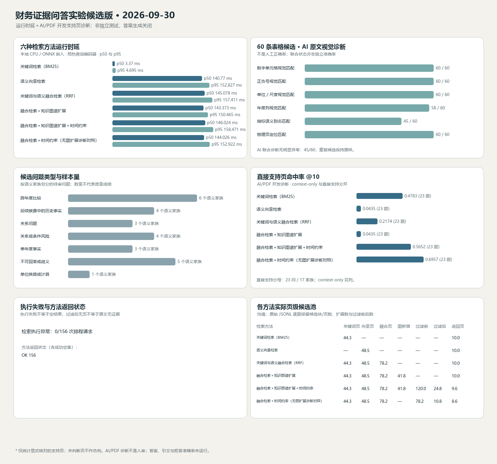

# 2026-09-29 财务证据问答候选版修复与交付记录

## 结论摘要

本轮得到的是**可复现的本地实验候选版**，不是已通过真实 Neo4j/Chroma 服务验收的稳定版。最新源码匹配构建 `build_7feb21b48e594a7a` 的包身份、图、向量、工程验收、执行配置、清单和不可变文件哈希均通过；7 个自然语言场景加 1 个显式参数场景共 8/8 被工程验收接受。六种检索方法在同一开发标签集上完成 156/156 次检索。质量标签仍是 AI/PDF 开发诊断，答案生成关闭；这些数值不等于独立测试准确率。

| 交付项 | 本轮实际结果 | 解释边界 |
|---|---:|---|
| 安全清理 | 实际删除 0 个文件、释放 0 字节；盘点到 9 个 Python 缓存目录，共 242 个文件、3,647,315 字节（3.48 MiB） | 精确目标与路径已验证，但删除命令被运行环境策略拒绝；缓存仍原位保留。没有换其他方式绕过 |
| 归档旧环境 | 保留 `archive/legacy-venv-2026-09-02`：73,884 个文件、2,126,490,538 字节，Python 3.14.3 | 现有锁定安装验证基于 Python 3.12.14，不能证明旧环境可精确重建；删除会丢失独有复现环境 |
| 当前候选构建 | `build_7feb21b48e594a7a`；395 页、843 向量块、198 accepted triples、362 expanded fact edges | 三种计数分别保留，不把 accepted triples 与 fact edges 混算；本机隔离包未上传 |
| 候选完整性/验收 | 完整性 8/8；工程问答验收 8/8；向量和图构建身份一致 | 验收是候选合同回归，不是人工答案准确率或真实 Neo4j 验收 |
| Python 回归 | `pytest -q`：227 passed、7 subtests passed、2 条 FastAPI 生命周期弃用警告；计算合同模块 51 passed | 自动化回归，不代表问答准确率 |
| 检索矩阵 | 六种完整中文方法名称；156/156 检索调用成功；26 个问题形式、20 个语义家族，23 个问题形式/17 个家族有已标注直接支持页 | 同一开发集的源码身份复测，不是冻结独立测试集；标签非穷尽 |
| 60 条表格候选 | AI/PDF 目视诊断：数值、符号、单位尺度、来源页各 60/60；财年列 58/60；语义别名 45/60；完整事实联合“无明显问题”45/60 | 全部仍未完成人工主审、第二人复核和裁决；不是准确率或召回率 |
| 实际服务与浏览器 | **未通过/未运行**：前端页面可打开，但显示本地 API 不可达；检查时 Neo4j 7474/7687 与 API 8000 均无监听 | 候选内 FastAPI `TestClient` 合同 200 不等于真实 HTTP 服务或浏览器成功；未点击并验证 PDF 引用页 |
| 当前活动存储 | 活动 Chroma 集合只读盘点为 1,686 项，非空 `build_id` 为 0；Neo4j 无可用本地监听 | 没有写活动库、影子导入或切换；1,686 项与隔离候选 843 块不可混用 |
| GitHub | 交付分支 `codex/financial-evidence-qa-delivery-2026-09-29`；现有 PR #1 目标为 `codex/v3-three-filing-evidence-graphrag`，保持 OPEN 且不合并 | 本报告随交付提交更新；最终 SHA 与其 CI 在远端核验后补入 PR 记录；不更新 `stable` |
| 多模型调度证据 | 有 Sol 与 Astra 子任务的任务 ID、请求覆盖模型/强度、公开任务输出和采纳决策 | 平台没有暴露实际模型身份或实际推理强度；这两项均记录 `NOT_VERIFIED`，不以请求覆盖冒充实际执行元数据 |

因此，本轮选择：**可复现的实验候选版（范围受限）**。不选择“已通过真实服务验收的工程稳定候选版”。

## 构建来源与复现边界

- 构建 ID：`build_7feb21b48e594a7a`。
- 换行规范化后的内容源指纹：`ab2693cf127abd39a28c6d70f576ae996778302ee225e11dec8e574b389606d2`。
- 构建记录中的 Git HEAD：`52da4485034ef82d4fc2fc320b4c6a0c0a817072`。构建时仅 `build_identity.py` 与指纹回归测试尚未提交；源码身份只纳入文本换行规范化后的源码/依赖内容。新的 clean-checkout 验证应在该修复提交上传后，将此指纹与 Git 检出复算结果比较。
- 三份输入 PDF 的 SHA-256：
  - 2023：`89981bbfcd91e20498c1060d7efb39022ac8f85e639f2841091695885aa9f8a8`
  - 2024：`536f66d7f1c3413abbf643e0a02bd0aab65639116fe630225f3f93529244658b`
  - 2025：`b67bd67a64488a54886de001c788bc5059a965fc6ef5b4d8b71624951e13df8e`
- 构建使用本地规则/表格抽取与 `chroma_onnx` 的 `all-MiniLM-L6-v2` 嵌入。构建日志记录 LLM 调用 0、网络调用 0；检索矩阵生成关闭，LLM 调用 0、网络调用 0。没有伪装模型生成结果、token 或费用。
- 本地不可变包位于 `reports/isolated_staging/build_7feb21b48e594a7a`，受忽略规则保护，未上传。公开复现需要按 [`data/README.md`](../data/README.md) 获取许可允许使用的 PDF，并先核对上述哈希；GitHub checkout 本身不含 PDF 与 Chroma 包。
- 该候选还包含确定性计算状态的前端展示；TypeScript/Vite 生产构建通过。浏览器实时 API 不可达，因此没有宣称面板已在真实查询页面端到端展示成功。

复现本轮检索复测（使用现有、与哈希相符的 PDF；输出路径必须是新的空路径）：

```powershell
& {
  # Isolate this no-LLM candidate build from any machine-level provider setting.
  $env:LLM_PROVIDER = "local"
  $env:LLM_MODEL = "Qwen2.5-3B-Instruct"
  $env:LLM_RESPONSE_CACHE_MODE = "off"
  .\.venv\Scripts\python.exe scripts\run_isolated_staging.py
}
.\.venv\Scripts\python.exe scripts\run_financial_retrieval_matrix.py `
  --build-dir reports\isolated_staging\build_7feb21b48e594a7a `
  --dataset experiments\financial-evidence-qa-2026-09-28\financial_qa_dev_source_review_20260924_v3.jsonl `
  --output experiments\financial-evidence-qa-2026-09-29-calculation-contract\financial_retrieval_raw_20260930_build_7feb21b48e594a7a.jsonl
.\.venv\Scripts\python.exe scripts\summarize_financial_candidate_run.py `
  --raw experiments\financial-evidence-qa-2026-09-29-calculation-contract\financial_retrieval_raw_20260930_build_7feb21b48e594a7a.jsonl `
  --table-audit experiments\financial-evidence-qa-2026-09-28\table_quality_ai_visual_diagnostic_2026-09-24_v2.jsonl `
  --dataset experiments\financial-evidence-qa-2026-09-28\financial_qa_dev_source_review_20260924_v3.jsonl `
  --output experiments\financial-evidence-qa-2026-09-29-calculation-contract\financial_retrieval_summary_20260930_build_7feb21b48e594a7a.json `
  --chart experiments\financial-evidence-qa-2026-09-29-calculation-contract\financial_retrieval_summary_20260930_build_7feb21b48e594a7a.png
```

每次复跑都使用新的原始记录、摘要和图表路径；脚本拒绝覆盖已有产物。当前 `build_7feb21b48e594a7a` 为核实 Windows Git 换行转换问题修复后的候选。它使用相同源码逻辑、PDF、协议和标签，无调参或改标签；为验证新的跨检出稳定指纹而第三次执行同一开发集，超出 v4 单次主运行安排，必须披露为协议偏差。旧候选与原始记录全部保留，运行间延迟/分数不合并。冻结 v4 协议、标签和历史主报告未改写。

### 干净检出发现及修复

2026-09-30 从交付分支做 Windows 干净检出时，Git 默认 `core.autocrlf` 将 JSONL 工作树改为 CRLF，汇总脚本因此因 raw-manifest SHA 不匹配而安全拒绝运行；同一检出计算出的源码指纹也与候选包不同。根因为源码指纹把文本换行字节当作语义、而新实验目录没有字节精确保留属性。修复为：构建源码/依赖指纹统一先把 CRLF 与孤立 CR 规范成 LF；对有 SHA 约束的 2026-09-29 实验包在 `.gitattributes` 设 `-text`，原始记录保持逐字节一致；新增 LF/CRLF 指纹回归测试。清洁检出依赖安装与当前源码测试的最终复核结果以追加提交后的同分支新检出为准，初始的 hash mismatch 失败不能从记录中删去。

本地候选重建的一次启动日志曾显示机器默认的外部 provider 已初始化。隔离 pipeline 显式配置 `use_llm=False`，所以 LLM 抽取分支不会调用；我在候选抽取前中断该次启动，并在 `LLM_PROVIDER=local`、响应缓存关闭的进程范围内续跑。三份文件逐项记录均为 `llm_calls=0`、`network_calls=0`。因此初始化日志不被误报成模型调用，未向外部模型发送年报。

## 计算合同：失败、根因、修复与同条件验证

| 原失败 | 根因 | 修复 | 同条件结果 |
|---|---|---|---|
| 单位字符串为 EUR billions，却被结构字段覆盖成 USD 并 PASS | 币种、尺度字段与规范化单位没有交叉校验 | 不一致时返回 `INVALID_INPUT`；尺度冲突同样拒绝 | 同输入从错误 PASS 改为 `INVALID_INPUT` |
| 年度比较未说明年份，输出空值却 PASS；年度请求可吃进季度值 | query plan 丢失期间粒度，观测事实期间校验不严格 | 保留年度/季度计划；未解析期间不推断；显式缺年不能成功 | 无法确认所需期间返回 `INSUFFICIENT_EVIDENCE`；季度/年度不匹配不再 PASS |
| 不可比值的增长计算仍返回数字；重复冲突受排序影响 | comparability 检查发生在去重之后，跨年度路径绕过检查 | 在候选选择前检查冲突；显式 `NOT_COMPARABLE` 拒绝；重复冲突顺序无关 | 返回 `AMBIGUOUS`，不输出伪计算 |
| 两个公司的观测被配成一组计算 | 没有强制单一公司作用域 | 多公司时要求明确公司过滤 | `AMBIGUOUS`，不混算公司 |
| 负数/非有限输入或大数溢出可能输出不可编码结果 | 最终 JSON 数值未做有限性检查 | 对输入及最终结果检查有限浮点数，越界不能 PASS | 负值单位转换保留符号；零分母、非有限值、溢出不能 PASS |

同一回归模块现有 51 条测试覆盖币种/尺度冲突、缺失年份、期间粒度、重述披露冲突、重复可比性、负数、零分母、百分比、混合单位、非有限值和作用域。全库结果为 227 passed、7 subtests、2 条既存弃用警告；新增指纹换行测试用于覆盖 LF/CRLF 检出一致性，不属于答案准确度。

### 实际 PDF 派生的跨年营收对照

独立审查核对了 2025 NVIDIA 10-K 第 80 页“Revenue by End Market”表与候选构建记录：同一披露、同一 claim、同一物理页、同一表、同一 `Total revenue` 行、同一单位/币种/尺度、同一公司/指标/build，数值映射为 FY2023 26,974、FY2024 60,922、FY2025 130,497 USD millions；第 52 页合并损益表另有同值交叉印证。本候选的 Q04 按三年值成功返回，并标记 `CONDITIONALLY_COMPARABLE`。

这里的 `PASS` 仅表示按该同披露表格结构完成了数值选择/计算；它不是全面审计会计政策、期间调整或重述历史，也不支持收入变化的因果解释。该推断不能自动外推到别的指标、表格或构建。Q01–Q07 的部分公开响应保留 `answer_status=NOT_REQUESTED`；兼容字段 `outcome=PARTIALLY_ANSWERED` 不能被读作已完成人工核验的自然语言答案。

失败的中间构建 `build_f4113e38d62735ff` 保留：7/8 工程场景通过，三年营收因比较状态未确认而拒绝；修复为严格的同披露同 claim/页/表/行条件后，`build_38321fdf7366bf38` 通过 8/8。前端计算状态视图版本为 `build_1aa1530fdd382d17`；换行稳定指纹修复版本 `build_7feb21b48e594a7a` 也通过 8/8。所有成功候选包和部分中断包均保留。

## 检索矩阵：开发诊断，不是独立答案质量

条件：同一新隔离构建、同一 843 块语料、同一 26 个问题形式、同一 20 个语义家族、并发 1；候选集执行串行 156 次请求，26 个问题形式 × 6 种方法。只有 23 个问题形式（17 个语义家族）有已标注直接支持页，显式相关的被判断页实例共 30；未判断页不是负例。所有方法均使用最多 10 个最终物理页；这不代表各方法候选池相同，也不证明回答上下文预算完全等价。

| 完整中文方法名称 | 显式正页命中请求 | 家族等权直接支持页命中率（描述性 95% CI） | 家族等权 MRR@10（描述性 95% CI） | p50 / p95（毫秒） |
|---|---:|---:|---:|---:|
| 关键词检索（BM25） | 11/23 | 0.4118（0.2059–0.6176） | 0.2348（0.0868–0.4147） | 3.370 / 4.695 |
| 语义向量检索 | 1/23 | 0.0588（0–0.1765） | 0.0294（0–0.0882） | 140.770 / 152.827 |
| 关键词与语义融合检索（倒数排名融合） | 5/23 | 0.1765（0.0294–0.3529） | 0.0878（0.0065–0.2198） | 145.078 / 157.411 |
| 融合检索＋知识图谱扩展 | 1/23 | 0.0588（0–0.1765） | 0.0294（0–0.0882） | 143.373 / 150.465 |
| 融合检索＋知识图谱扩展＋时间约束 | 13/23 | 0.4706（0.2647–0.7059） | 0.1687（0.0567–0.3179） | 146.024 / 158.471 |
| 融合检索＋时间约束（无图扩展诊断对照） | 16/23 | 0.6176（0.3824–0.8235） | 0.2493（0.1304–0.3941） | 144.026 / 152.922 |

这些分子/分母是被标记的直接支持页命中请求，不是完整语料 `Recall@k`。标签池不穷尽，所以 nDCG 未计算。95% 区间按 17 个语义家族做 2,000 次描述性 bootstrap，不能升级成论文独立置信结论。配对家族差值：知识图谱扩展相对倒数排名融合为 `-0.1176`（区间 `-0.3235–0.0882`）；图扩展＋时间相对不扩图时间对照为 `-0.1471`（区间 `-0.4118–0.1471`）。区间均跨 0，不能证明优越或等效；点估计倾向不扩图的对应对照。



资源记录：Windows 11，16 个逻辑 CPU，系统内存 16,961,822,720 字节；Python 3.12.14；本地 `all-MiniLM-L6-v2` ONNX 查询嵌入；查询预热 0.212 秒（不计入单请求延迟）；无结果缓存；无生成；单并发；156 请求共 19.472 秒，含初始化/串行查询的吞吐 8.012 请求/秒；进程峰值 RSS 315,101,184 字节（约 300.6 MiB）。该次运行紧随构建与此前矩阵执行，OS 文件缓存未受控，因此不将其与之前的时延视为性能提升，亦不合并统计。冷启动 p50/p95 未测；并发 2、4 未测；没有 LLM 调用或网络调用，token 和模型费用不适用。

## PDF 表格候选与审核等级

60 条候选的来源文件哈希为 `9a9f9d709b10729066a2285ebad64f0c5c5dfc008ca5b1187ddf657ce3855536`。可重复运行的摘要表明：

| 字段 | AI/PDF 视觉诊断 | 人工审核状态 |
|---|---:|---|
| 数值单元格在来源页可见 | 60/60 | 未运行 |
| 正负号匹配 | 60/60 | 未运行 |
| 币种与尺度视觉匹配 | 60/60 | 未运行 |
| 来源物理页定位 | 60/60 | 未运行 |
| 财年列匹配 | 58/60；2 条期间未明确 | 未运行 |
| 指标语义别名匹配 | 45/60；9 条比例基准待说明、4 条报表上下文待说明、2 条期间/指标归属待纠正 | 未运行 |
| 联合诊断无明显问题 | 45/60 | 未运行 |

这只是自动候选的 PDF 视觉诊断，不是准确率。重复键保留，因为重复事实可能是不同来源证据；60 条候选不能估算系统抽取召回率。现有 30 行/20 个唯一问题的工程答案集是单人审核材料，不构成双人 Gold；独立复核、裁决以及基于冻结独立集的答案质量本轮均未形成。

## 端到端服务、存储和恢复边界

- 查询运行器通过隔离 JSON 图适配器和版本绑定的 Chroma 快照执行；原始构建包未被查询写入，测试时使用临时可写副本，构建包完整性复核通过。
- 构建内 FastAPI `TestClient` 路由返回 200，响应、query plan、确定性计算、引用及源定位六项合同断言通过。这是应用内测试客户端，不是实际 TCP 服务测试。
- Codex 浏览器中 `http://127.0.0.1:5173/` 可见前端，但页面显示 `Cannot reach the local API`；检查时 8000、7474、7687 无监听。没有提交真实浏览器查询，没有 PDF 点击打开成功截图，也没有把工具内的屏幕截图冒充持久化演示文件。
- 活动 Chroma 只读检查显示 1,686 项且 metadata/非空 `build_id` 未绑定；真实 Neo4j 路径投影已经核对代码会返回 observation 属性并映射数值/单位，但实际数据库未运行，不能声明真实存储适配器通过。
- 代码审阅确认 Neo4j `find_metric_disclosures` 路径会投影 observation 属性，并将 `observation.value/unit` 映射到 `metric_values/metric_units`，同时包含公司、指标、期间、披露版本和 build 过滤。该投影只由代码与本地适配器合同核验；由于 Neo4j 不可连接，真实存储返回的数据形状与版本隔离仍未实测。
- 旧 `published_pointer.json` 对应的 `build_0be5c1b2939c6583` 哈希仍损坏；没有改指针、没有覆盖旧数据、没有建影子命名空间或执行切换/回滚。候选包不设成生产默认。
- 并发 1/2/4 服务压力、冷启动、依赖超时真实联调、重启恢复、部分构建故障后的恢复、发布回滚、跨版本活动数据库隔离、认证/上传/部署安全验收均未完成。

## 清理盘点与未执行动作

以下 9 个非链接 Python 缓存目录均位于仓库内，逐目录记录了路径、文件数和逻辑大小。删除前已解析绝对路径、确认位于仓库、检查链接属性、核对大小，并确认没有运行中的项目 Python 进程。随后原生 PowerShell 的精确 LiteralPath 删除命令被运行环境策略拒绝；**所有目录仍在原位，未删除任何文件**：

| 路径 | 缓存文件数（仍保留） | 逻辑大小（仍占用） | 判断依据 |
|---|---:|---:|---|
| `tests/__pycache__` | 94 | 748,651 字节 | Python 字节码；运行 pytest/compileall 可重建 |
| `strategic_graphrag/__pycache__` | 17 | 251,741 字节 | 同上 |
| `strategic_graphrag/schema/__pycache__` | 6 | 87,440 字节 | 同上 |
| `strategic_graphrag/pipeline/__pycache__` | 14 | 421,073 字节 | 同上 |
| `strategic_graphrag/ontology/__pycache__` | 8 | 127,701 字节 | 同上 |
| `strategic_graphrag/evaluation/__pycache__` | 8 | 88,244 字节 | 同上 |
| `strategic_graphrag/engine/__pycache__` | 13 | 530,034 字节 | 同上 |
| `strategic_graphrag/api/__pycache__` | 4 | 175,813 字节 | 同上 |
| `scripts/__pycache__` | 78 | 1,216,618 字节 | 同上 |

实际释放空间为 **0 字节**，实际删除文件为 **0**。没有删除、合并或归档任何项目脚本：本轮没有完成足以证明脚本安全合并的入口、CI、动态调用和历史迁移全量审计。没有删除隔离 staging 中的旧候选/失败包，也没有删除 `tmp/` 的 PDF 页面图、历史评估数据、SQLite/Chroma、虚拟环境或旧 archive。`archive/legacy-venv-2026-09-02` 有 73,884 个文件、2,126,490,538 字节，Python 3.14.3 下记录 226 个已安装包，其中 187 个与当前 Python 3.12 锁文件缺失或版本不一致；不能声称由当前锁文件精确重建，故保留。缓存的 `compileall`/pytest 重建命令已记录，但本次因策略拦截未执行清理。物理磁盘/云盘配额变化未测量。

重新生成字节码的命令：

```powershell
.\.venv\Scripts\python.exe -m compileall -q strategic_graphrag scripts tests
.\.venv\Scripts\python.exe -m pytest -q
```

## 多模型任务调度的可验证记录

可复核记录见 [`multi_model_dispatch_record_20260929.json`](../experiments/financial-evidence-qa-2026-09-29-calculation-contract/multi_model_dispatch_record_20260929.json)。公开记录只包含任务 ID、请求覆盖参数、公开任务输出、采纳结论及验证；不保存隐藏思考。

- Sol 子任务审查了期间解析、观测冲突、跨年比较、有限值和越界观察值传播；对应修复已采纳并经 51 条焦点测试、226 条全量测试验证。
- Astra 子任务复核实验标签口径与来源证据，并逐项核对 2025 10-K 第 80 页三年营收同一行映射；保留窄范围 `CONDITIONALLY_COMPARABLE` 判定，拒绝把它表述成全面会计口径审计。
- 平台任务记录能证明这些子任务被显式派发且已返回公开输出；实际后端模型和实际推理强度均 `NOT_VERIFIED`。父执行者的实际模型/强度也未暴露。没有把用户指定的工作流配置当作平台观测事实。

## 当前可讲述与不可讲述的结果

**可以讲述：** 对三个哈希确定的 NVIDIA 10-K 建立了隔离、不可变、按 build 绑定的实验包；实现了有类型数值观察的保守计算合同；源码匹配候选通过 8 项工程验收；复测六种真实不同检索模式；在当前已判断的开发支持页上，融合检索＋时间约束（无图扩展诊断对照）有更高的观察命中点估计且延迟低于两种图扩展臂；这个结果应促使下一轮测试“何时不需要图扩展”。

**不能讲述：** 独立/双人审核的问答准确率、完整语料召回率、图谱普遍优于融合基线、因果解释有效、60 条候选的抽取准确率/召回率、真实 Neo4j/活动 Chroma 兼容、真实浏览器 PDF 引用流程通过、并发或生产稳定性、LLM 生成质量、模型成本或任何未实测吞吐/延迟。

## 最多三个后续方向

1. **先修标签与参考事实。** 对 60 条候选逐行补齐财年期间、比例分母、报表类型和指标归属；双人独立审核后再裁决。另从未被系统选中的 PDF 页独立抽取事实清单，才能测抽取召回；开发/测试按语义家族分开并冻结。
2. **检验图扩展的选择条件。** 现有家族配对点估计分别为 `-0.1176`、`-0.1471`，并未显示图扩展净收益。下一轮只检验关系/条件风险题是否受益；使用相同候选预算、最终上下文预算和家族级配对分析，并记录新增、无关和挤掉的证据。若无收益，就保留负结果并收窄图扩展适用范围。
3. **完成真实存储影子验证再谈稳定发布。** 在 Neo4j 可用后创建新 build-scoped namespace/collection，从来源哈希重新导入并核数量/代表记录/隔离；先做真实 API 与浏览器查询、点击引用 PDF 页及回滚验证，再审查认证、日志和并发。活动库与损坏旧指针在此之前保持不动。
