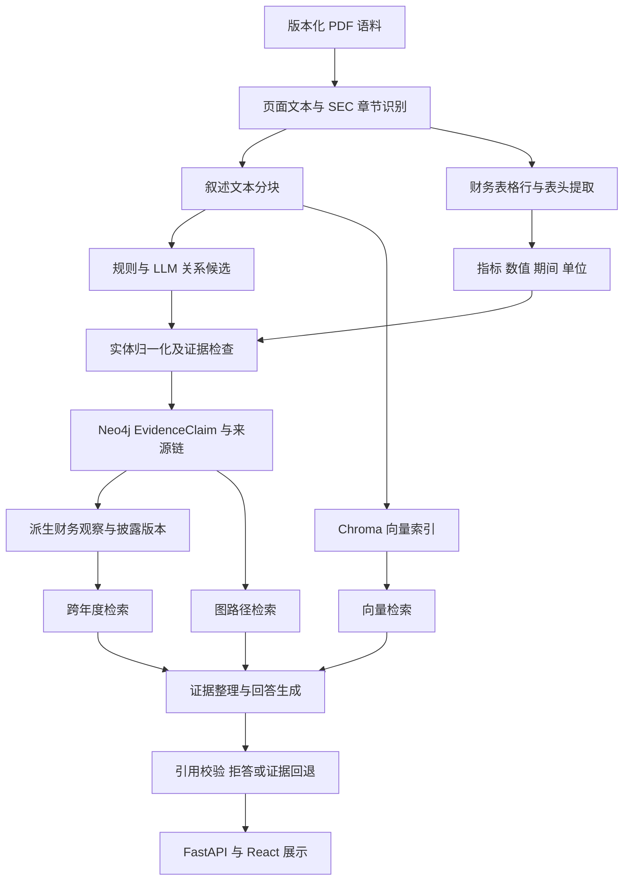

# 证据约束型 GraphRAG：系统设计与论文写作依据

核对日期：2026-09-11。本文说明实际工程设计、已验证行为和研究边界，不替代语义评测或参考文献核验。原始 Word 文件保留不改。

## 可用于开题报告的研究定位

本课题面向 NVIDIA SEC Form 10-K 年度报告，设计并实现证据约束型 GraphRAG 研究原型。研究对象包含财务表格、经营讨论和风险披露等信息。系统将页面中的披露内容组织为具有来源文件、页码、文本块、实体和关系类型的证据记录，结合向量检索与有向图路径搜索，为回答提供可检查的来源依据。

课题关注的是不同检索方式在财报证据查找、关系组织和跨年度披露比较中的适用条件。财报所述因果和风险关系属于披露内容，不构成经过计量识别的因果效应。系统不用于预测投资收益，也不以生成流畅答案作为事实正确性的证明。

## 实际系统链路

图中表示模块职责，不意味着所有模式使用相同的证据集合。当前混合模式会利用向量命中寻找图谱锚点，最终回答仍主要依赖图谱证据路径。因此，混合检索不能被简单描述成“向量结果与图结果全部合并后生成”。

## 各层必须满足的约束

| 层次 | 应保存的内容 | 不能由该层单独证明的内容 |
|---|---|---|
| PDF 与文本 | 文件版本、物理页码、原始文字和版面位置 | 阅读顺序和表格语义必然正确 |
| 表格抽取 | 行标签、全部期间列、数值、单位、表头上下文 | 不同报表口径之间可以直接比较 |
| 实体与关系 | 原始措辞、标准实体、关系方向、情态及证据 | 同句出现就意味着该关系成立 |
| EvidenceClaim | 文档、页码、chunk、原文、来源和目标实体 | VERBATIM 就意味着语义正确 |
| 派生模型 | 支撑 claim、模型版本、有效期间和记录时间 | 后一次披露意味着前一次事实被证伪 |
| 检索 | 范围过滤、排序、实际返回证据及模式 | 找到一条路径就完成了完整推理 |
| 生成与引用 | 主张对应的证据 ID 与来源页码 | ID 和页码合法就意味着每句话被蕴含 |

PDF 的物理页码、文件内印刷页码与 SEC HTML 位置应分别处理，不能在不同表示之间直接替换。表格引用应同时提供表名、期间和单位，仅显示一行数字不足以让读者核验年份。

## 四种检索方式的实验含义

Vector 使用文本向量相似度返回候选片段；Graph 使用实体锚点与有向关系路径返回图谱证据；Hybrid 将向量召回与图谱锚点、路径和排序结合；Hybrid+Temporal 在混合检索中引入时间相关信息。具体功能开关必须以每次运行的 router 元数据为准，而不是仅凭模式名称。

对照实验需要冻结语料、代码版本、问题集、嵌入模型、候选预算、最终 K、缓存状态、重排器和 LLM 锚点辅助开关。`synthesize=false` 只关闭答案生成，当前普通 API 的图检索仍可能调用 LLM 提取锚点；不能据此把一次检索称为完全离线或无 LLM。现有 Silver 评测另外禁用了锚点辅助和重排器，与普通 API 的运行条件不同。

Vector 的片段与 Graph 的 claim 不是同一种单位。跨模式可以统一为文件加页面的键，但页面命中不等于命中了完整答案证据；同一页上可能存在多个无关表格或段落。论文应同时报告评测单位、相关性判定规则及局限。Silver 标签若从已有图谱生成，可能偏向图谱可表达的问题，只能用于自动回归和错误发现。

## 建议写成研究问题

1. 在固定语料和问题集上，四种模式对于事实查找、披露关系、多跳证据与跨年度问题的检索表现分别如何？
2. 表头、期间和单位信息的保存是否减少财务数值的错误解释？
3. 页码和证据 ID 校验能够发现哪些引用错误，又不能发现哪些语义错误？

目前不能提前回答“图检索更优”。负面结果同样有研究价值，例如实体归一化错误如何污染图路径、向量检索为何优先召回递延收入而非总收入、某模式在部分问题上未找到完整证据。

## 论文结构与材料归属

绪论说明证据可追溯需求和研究边界；相关研究分别讨论检索增强生成、图谱、文档表格和金融问答；需求与系统设计说明数据对象和模块职责；实现章节说明解析、抽取、版本管理、检索和生成；实验章节区分结构检查、自动 Silver 回归、人工语义评测及性能；最后通过错误案例讨论局限。

开题阶段可写已实现模块、研究问题和拟定评价方法。当前运行结果可写入“原型验证”或“系统测试”，必须带日期和条件。正式实验章节的准确率、模式优劣和统计结论仍需后续评测，不能用测试通过数或一题运行成功代替。

## 对当前 Word 开题报告的修订建议

已只读提取 `GraphRAG初稿.docx` 正文。当前文件不是空文件；其中已有研究背景、综述、设计、计划和参考文献。本次未核验参考文献的真实性、引文对应关系及 Word 排版。

- “证券公司年报”建议改成“上市公司年度报告”，NVIDIA 并非证券公司。
- “当前会排除变化列”等表述应补充限制：三年期间截断问题已修正代码，但存量图谱尚未迁移；百分比行和复杂表头仍需专项检查。
- “统一多问题检索基准缺失”需要更新：存在 2026-09-15 的 37 题自动 Silver
  报告，四种模式均已按固定配置运行，但正式独立人工评测仍未完成。
- “通过校验的证据”应注明校验维度：逐字匹配、结构与引用一致性不等于语义蕴含验证。
- 计划中的扩充语料和消融实验应明确为拟开展工作，每次比较固定一个语料版本，不把新增文件混入同一组结果。

## 申请材料的保守描述

开发面向 NVIDIA SEC 10-K 财报的证据约束型 GraphRAG 研究原型，结合 PDF 页面与表格处理、规则和大语言模型抽取、Neo4j 证据图谱及 Chroma 向量索引，实现四种检索模式和可追溯到原始页面的回答接口；建立结构检查、自动回归与错误诊断流程，持续改进实体归一化、财务期间匹配和跨年度披露处理。项目尚未完成独立人工语义评测，现阶段成果属于研究型工程实现与系统验证。
