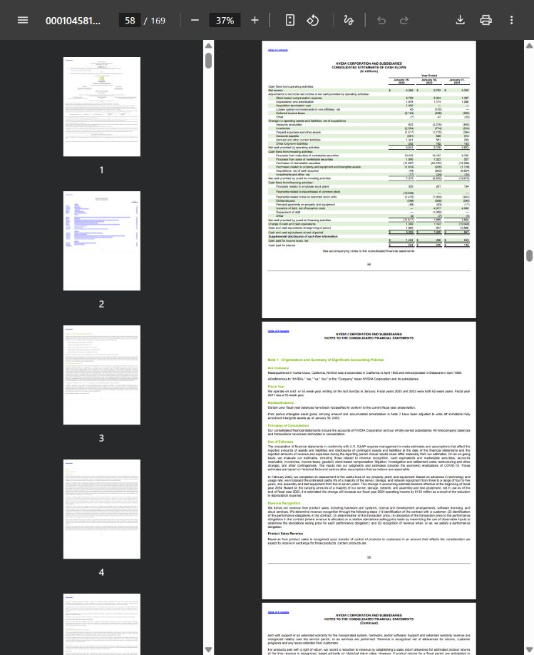

# Answer correctness closure · 2026-10-03

**Release decision: restricted research prototype. Reliable-answer acceptance FAILED.**
The two permitted development repair rounds are complete. Frozen validation was not used for a third repair. Wrong answers labelled `PASS` remain public evidence, not successful requests.

## Identity and evidence level

| Version | Build | Accepted triples / expanded edges / observations | Source identity |
|---|---|---|---|
| October 2 historical | `build_c3b1d950e8acce78` | 187 / 324 / 233 | `1bd675377637941c937015c2e12e7fe0432b983667b4b1a7b489799fa96cf8ab` |
| Development round 1 | `build_6c2df78148ecbecd` | 191 / 331 / 240 | `a2ab7168a3ef1ce0f0cc312663bc34d398fc93b3bf14fc7905dc1924a4b885a6` |
| Development round 2 and frozen validation | `build_ff4e5bcf11c71930` | 226 / 414 / 323 | `f0694cf94608d880f2c5d4ea666b46aad6621cc0f7605e47cb0a2bbed0c90a37` |

All three: NVIDIA's three filings, 395 pages, 843 vector chunks. Code parent is `88298582f83ac6437758f6a166e44d630ae8e376`; the final run used local changes bound by the source fingerprint above, **not the unchanged parent commit alone**. Some raw records have a null `source_fingerprint`; their build ID, preflight and immutable identity supply the actual binding. Do not invent a missing field.

Final real database: isolated loopback Neo4j `bolt://127.0.0.1:17691`; vector collection `isolated_build_ff4e5bcf11c71930`. [Import](import-v2.json), [preflight](validation-run-v1/preflight.json), [protocol](protocol.json), [labels](validation_labels.json), [input hashes](frozen_inputs_sha256.json), [scoring hashes](frozen_scoring_sha256.json).

Review level is **AI/PDF diagnostic**. No human confirmation, second-person review or arbitration occurred. Reference facts were transcribed from original PDF material before predictions. Forty operation-plus-metric/boundary families are not forty entirely unseen metric families: direct facts, conversions and differences reuse some metrics and earlier development concepts. These results are not independent human Gold or paper-level accuracy.

## Frozen validation: separate input conditions

Every row below: 40 questions / 40 declared families; 33 answerable, seven refusal boundaries; final build; AI/PDF tier. The numerical column means **number and unit together**, not a separately measured number-only score.

| Input condition | Core semantics | Number + unit | Citation support | Metadata / joint | False refusal | Wrong PASS | HTTP | p50 / p95 ms |
|---|---|---|---|---|---|---|---|---|
| Natural language, question only | 25/33 | 25/33 | 21/24 judged; 9 unjudged | 21/33 / 21/33 | 5/33 | 4/40 | 40/40 | 28.55 / 415.08 |
| Explicit user-file selection fixture | 25/33 | 25/33 | 21/24; 9 unjudged | 21/33 / 21/33 | 5/33 | 4/40 | 40/40 | 32.85 / 215.95 |
| Correct reference-file diagnostic | 25/33 | 25/33 | 21/24; 9 unjudged | 21/33 / 21/33 | 5/33 | 4/40 | 40/40 | 31.79 / 56.99 |

Natural-language core semantics: **75.8%**, descriptive Wilson 95% interval **59.0–87.2%**. Shared metrics limit independence. Safe refusal: **6/7**. Successful HTTP-subset answer denominator remains 33; HTTP 200 is not answer correctness. Question-only input does not include reference filing/year/metric/evidence/answer. The user fixture chooses the label-corresponding file as an explicit artificial selector input; it is not evidence of natural user behaviour. Diagnostic results do not count toward the main score.

The run is graph-only, generation off, query cache off, warm database, restarted HTTP per condition, uncontrolled operating-system cache. These timings are neither production SLOs nor comparable to old vector-embedding retrieval timings. [Resources](validation-run-v1/question_only-resources.json) cover the recorded process scope, not total machine energy or all database processes. Token/cost data were not measured; no zero-cost inference is made.

[Raw natural-language records](validation-run-v1/question_only.jsonl) · [All conditions and slices](validation-summary-v1.json) · [Failure traces](failure-traces.json).

Citation support is direct fact support, not mere background-page overlap. Unjudged evidence is not a negative. Physical-page scoring checks source linkage; actual viewer navigation is separately recorded below. Multiple observations are permitted only after verifying the same factual identity; conflicting sources cannot be cherry-picked.

## Repairs, retest and failures

| Development evidence | Before | After two rounds | Remaining limit |
|---|---|---|---|
| Same 13 answerable development forms | 9/13 core correct, 4 refusals after round 1 | 11/13 core correct, 2 refusals | Disclosed percentages remain unusable through the real adapter |
| Eight quarter paraphrases | Explicit quarter identity, no annual fallback | 8/8 safe refusal | Quarterly answering is outside the verified scope |
| Eight retained numerical references | Historical 6/8 then 8/8 | 8/8 retained | Development regression, not independent accuracy |
| Cash-flow receivables and Data Center | Balance / total substitutions | Correct scoped movement / segment facts in replay | Unseen aliases still fail |

Production code now carries business scope, balance versus movement, amount versus ratio and period grain; requests are checked against observation identity before output. Specific statement context is preserved from table extraction through accepted facts, typed observations and graph storage. Disclosed percentage child rows retain their parent metric and percent unit. No reference numbers were added to production code.

[Round 1](development-summary-v1.json) · [Round 2](development-summary-v2.json) · [Exact historical replay, including old errors](exact-historical-replay.json).

Frozen validation exposed four wrong `PASS` results:

- **Income before income tax** is planned as net income: 72,880 rather than 84,026 USD millions; the same substitution appears in conversion and difference questions. Three wrong `PASS` requests, not three independent root causes.
- **Divided by** is not identified as a calculation: a ratio request returns the first R&D fact with `PASS`.

Other refusals: income-tax expense/benefit and shareholders' equity aliases are not reliably mapped. Real Neo4j percentage records omit null currency; the required nullable observation constructor argument is then missing. All 20 inspected percentage records failed typed construction, although values existed in storage. The scorer does not forgive these adapter failures. The isolated failed build `build_1a4519957f149e89` remains failed; its manifest was not rewritten.

No further production repair followed frozen validation. The predeclared 90% core gate and zero severe wrong-`PASS` gate both fail. Metadata joint correctness does not replace core semantic correctness.

## Browser and lifecycle: measured scope

Five correct calculation displays were actually observed: fact/disclosure, Data Center, cash-flow movement, conversion, growth. Two citation clicks were followed through to **physically displayed** PDF pages: 2025 page 80 and 2023 page 58. This does not establish five complete user workflows. The quarterly refusal UI still shows annual evidence/grounding badges; it is misleading despite no numeric answer. On continuation localhost refused connection; prior captures do not prove present availability.



[Browser observations and limitations](browser/observations.json) · [Data Center display](browser/data-center.jpg) · [Growth display](browser/cross-year-growth.jpg) · [Quarter refusal UI](browser/quarter-refusal-visible.jpg).

[Lifecycle](lifecycle/lifecycle.json): real dependency failure returned HTTP **503 / DEPENDENCY_ERROR**; recovery and service restart each passed the same five fixed HTTP scenarios. Wrong-build and unavailable-dependency preflights rejected loading. Full service readiness remains degraded without configured generation; graph-only success does not establish full readiness.

[Isolated rollback](rollback/rollback.json): new → copied old → restored new profiles passed real HTTP checks with matching source, database, vector collection and configuration identities. Original old database and production pointers were not changed. This is not production failover, OS-crash recovery or public deployment.

## Recompute from a checkout (no database or model needed)

Run at repository root with Python 3.12. Use unused output paths; scripts reject overwriting results.

```powershell
python -m deployment.verify_answer_closure_artifacts
python -m deployment.summarize_answer_closure --run experiments/answer-correctness-2026-10-03/validation-run-v1 --output recomputed-validation.json
python -m deployment.summarize_answer_closure --run experiments/answer-correctness-2026-10-03/development-run-v2 --output recomputed-development.json
python -m pytest -q
```

The first command checks hashes, recomputes all three recorded summaries in an isolated temporary directory, and verifies their exact equality. Original PDFs, environments and database runtime copies are deliberately not distributed. For fresh real execution, acquire the three original NVIDIA SEC filings and match [source hashes](source_manifest.json); use the root installation instructions, build an isolated package, and provision isolated Neo4j credentials privately. The actual runner is `python -m deployment.run_answer_closure --help`; do not claim offline recomputation rebuilds a real service.

## Defensible conclusion

This prototype makes financial answer identity and source evidence inspectable, and its recorded experiments expose dangerous successful-looking substitutions. It is useful for studying fiscal-period/disclosure handling, deterministic calculations and evidence contracts. It is **not yet dependable for arbitrary neighbouring metrics or paraphrases**, and no latest-build retrieval superiority is established. Older six-method results remain bound to `build_7feb21b48e594a7a`.

Next bounded study should first eliminate semantic substitution and nullable-adapter loss using new development cases, then freeze a new untouched verification set. Do not retune on this set or call it independent afterwards. The two most consequential prerequisites are identity-preserving query planning and faithful typed storage projection—not a larger graph.
