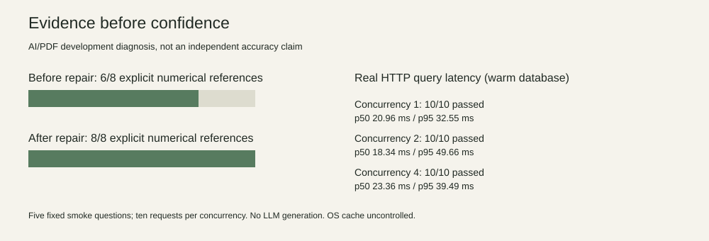

# 2026-10-02：真实财务查询闭环

目录沿用 9 月 30 日的交付任务名；每条运行记录以自身时间戳为准。

本轮定位：**可复现的实验候选版，已验证真实本地 Neo4j 与 HTTP 数值查询，不是公开生产服务。**

## 实际结果

| 项目 | 结果与口径 |
|---|---|
| 当前构建 | `build_c3b1d950e8acce78`，3 份 PDF、395 页、843 向量块 |
| 数据层 | 187 accepted triples，展开为 324 fact edges；233 typed observations |
| 原包保护 | 导入前、导入后、HTTP 查询后完整性均 PASS；未修改远端旧库或生产指针 |
| 真实存储门禁 | 本地专用 Neo4j、运行 Chroma 副本、来源哈希、真实数值投影通过 preflight |
| 开发问题 | 20 个语义家族、26 个问题形式，26/26 HTTP 请求成功 |
| 数值诊断 | 8 条具有明确单值参考的题，从 6/8 改为 8/8；AI 对照原文等级，不是人类 Gold |
| 引用支持页命中 | 12/25 → 14/25；只表示命中已判断支持页，不是完整引用正确率或召回率 |
| 固定集成场景 | 单年事实、披露版本、跨年增长、单位转换、超出语料拒答，5/5 |
| 并发试运行 | 并发 1、2、4，各 10 请求，均 10/10；另保留触发限流的失败运行 |
| HTTP 进程树内存 | 20ms 抽样峰值 163,434,496 字节；不包含 Neo4j、系统缓存和构建峰值 |
| 构建阶段耗时 | 文档 50.895s；候选 67.683s；接受 0.050s；向量索引 16.227s；验收 0.520s |
| 真实图导入 | 3.404s；单次局部测量，非多轮吞吐基准 |
| 回归 | 250 项测试、7 项子测试通过；不是答案准确率 |
| 清理 | 0 字节、0 文件；原生安全删除请求被工具策略拒绝，未绕过 |



| 并发数 | 成功场景 / 全请求 | p50（ms） | p95（ms，最近秩） | 成功吞吐（请求/s） |
|---|---:|---:|---:|---:|
| 1 | 10/10 | 20.961 | 32.555 | 43.530 |
| 2 | 10/10 | 18.341 | 49.663 | 76.796 |
| 4 | 10/10 | 23.355 | 39.487 | 122.429 |

Windows 11、16 逻辑 CPU、约 16.96 GB RAM；生成关闭、答案缓存关闭，数据库和本地模型缓存已预热，操作系统缓存未控制。每档只有五个固定问题、两次重复；不支持稳态容量或生产 SLO 结论。启动含 preflight 约 11.577s。应用整体 readiness 因未配置 LLM 返回 503；不将财务规则查询成功冒充生成服务就绪。

## 失败 → 根因 → 修复 → 同条件复测

1. 研发费用问题返回营业费用 7,434：查询缺少 R&D 别名，通用 expense 优先；补充具体指标映射，原问题返回 5,268，PDF 2023 p.43。
2. 应收账款返回 -2,215：现金流变动行被标成余额，而且 `Accounts receivable, net` 未匹配；加入净额行标签，将现金流变动与余额分开，返回 4,650，PDF 2023 p.56。
3. 股权激励研发分项可能污染总研发费用：显式股权激励附注分项使用独立指标名；保留报表类型、行标签与可比性字段。不通过扩大边数证明改进。
4. 构建首次引用接口 404：隔离目录没有原始 PDF；复制相同哈希的原文件后续跑通过，未跳过引用验收。
5. 开发题与并发题合计超过分钟预算，后续请求 429：保留原始失败，将独立速度试运行限制为 40 个查询；未关闭限流。原失败的毫秒级拒绝不计为有效查询加速。

数值修复仅用开发数据，一轮；这些家族不能再称独立测试。其他 18 个问题的完整语义答案未获自动数值评分，不能把 8/8 换算成 26/26 答案正确。

历史 `resources.json` 的 `queries:40` 只计固定场景与并发请求，附加开发题另有 26 条；合计 66 条查询，应从原始记录计数。旧记录未覆盖，新运行器分别记录这两个数量。最终速度试运行没有附加开发题，确实为 40 条查询。

## 重算，不需要数据库或模型

```powershell
python deployment/summarize_candidate_trial.py `
  --trial experiments/project-closure-2026-09-30/trial-20261002-bounded-benchmark `
  --development-trial experiments/project-closure-2026-09-30/trial-20261002-repair1 `
  --before experiments/project-closure-2026-09-30/trial-20261002-development `
  --output summary-recomputed.json --chart chart-recomputed.svg
```

输出路径必须尚不存在。评分从保存的响应和明示参考重算；保留全请求与 HTTP 成功子集分母。数据/协议文件哈希见 `public_hashes_v2.json`：数据逐字节，Python 协议源码统一 LF 后哈希。旧 `public_hashes.json` 保留初始上传快照，三个 Python 文件的原始字节哈希会随 Git 换行转换变化，不能据此宣称源码改变。`summary_20261002.json` 保留限流诊断；正式展示使用 `summary_20261002_final.json`。

另一份干净检出已使用仅标准库的评分入口成功重算 8/8 数值诊断及三档并发结果，不依赖本机 PDF、数据库、LLM 或未跟踪源文件。这证明公开原始记录可重算，不代表完整应用可无数据安装即用。

## 项目的实用性与科研价值

**实用价值判断：**适合单公司已知语料的财务取证、披露版本比较和可审查的确定性计算；不适合目前直接做投资建议、因果解释或无人监督开放式问答。真正有用的能力是把期间、披露版本、币种尺度和 PDF 定位连在一起，而不是回答听起来更流畅。

**研究判断：**已有六方法开发对照没有证明图扩展净收益。无图的融合＋时间约束命中 16/23，图扩展＋时间约束 13/23；配对家族区间跨零。历史检索记录与本轮真实数值记录是不同构建、不同指标，不能合并成一张准确率表。

微软 GraphRAG 的原始研究针对全局语料主题总结，其结论不能自动迁移到财务表格数值正确性。[原始论文](https://arxiv.org/abs/2404.16130)、[官方检索说明](https://microsoft.github.io/graphrag/query/overview/)。本项目可以研究时间/披露语义和按题型选择扩图，但组件组合本身不是创新证明。

后续只保留三条有证据的路线：

- **报表上下文完整性：**余额、现金流变动、费用总额与附注分项分开；在独立选取 PDF 页上测完整事实与遗漏，而非只测现有候选。
- **按题型控制扩图：**事实和计算优先有类型的观察值；关系问题才对照扩图。固定最终证据预算，统计新增相关页和挤掉的正确页，允许负结果。
- **披露与事实双时间验证：**保持事实期间、披露版本及重述冲突可追踪；用新的独立家族验证，不在本开发集反复调参。

## 文件与环境清点

10 月 2 日盘点 200,567 个普通文件、7,501,964,496 逻辑字节，跳过 413 个链接/reparse point，0 扫描错误；这不是实际占用块数。详细绝对路径清单只保存在本地，公开材料不包含个人路径/配置。

保留 active `.venv`、原始 PDF、人工资料、候选包和唯一失败证据。`archive/legacy-venv-2026-09-02` 的 9 月 30 日快照约 2.126 GB，但含 65 个按规则保护的文件，不能仅凭旧名称删除。三个明确 Python 字节码缓存被选作最小清理目标，删除命令被策略拒绝，实际未删除。新增只读盘点主入口不跟随 junction、不读取密钥内容、不将“搜索不到引用”当作删除证明；兼容和迁移脚本没有盲删。

本轮未将候选切换为生产默认。真实 HTTP/PDF 校验不是新构建的浏览器点击验收；既有浏览器材料也不被挪用为新构建截图。
