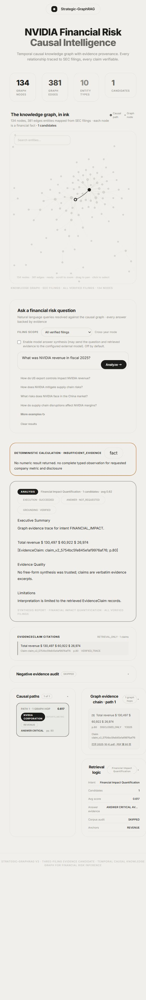
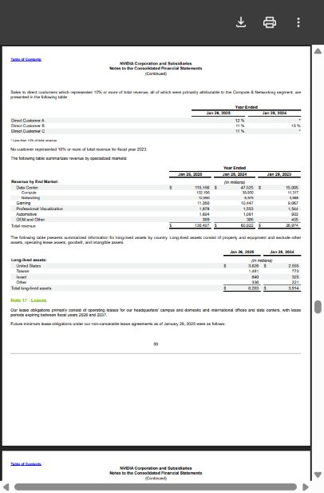

# Public-demo readiness — actual local run, 2026-09-30

**Release decision: experimental candidate only; not deployed or production-ready.**
The user has not prepared a server or domain. This directory preserves the
real local service failures, not a successful candidate-store deployment.

## What ran

| Check | Actual result |
|---|---|
| Five real HTTP query attempts | 5/5 returned HTTP 200 |
| Fixed scenario assertions | 1/5 passed; all four numeric cases failed |
| Numerical calculation | `INSUFFICIENT_EVIDENCE` on fact, disclosure, growth and conversion |
| Correct refusal fixture | 1/1 out-of-corpus-year case passed |
| Local readiness | HTTP 503, dependency probe timed out after ~12 seconds |
| Query elapsed time, second smoke run | p50 1,072.764 ms; max 19,819.203 ms |
| Browser query and citation | Real result displayed; clicked citation opened 2025 filing physical page 80 |
| Immutable candidate before/after inspection | Package checks passed; source identity matched |
| Real-store production gates | Rejected unbound/mismatched legacy data |
| Public HTTPS/container deployment | Not executed; no hosting resources |

Both all-attempt and HTTP-success denominators are five. This is a
single-concurrency, five-question, one-repetition smoke run, not an independent
accuracy estimate, latency benchmark, resource benchmark or causal study.
No generation was requested. Paid generation cost, cold start and peak memory
were not measured; missing measurements are not zero.

References are **AI/PDF integration fixtures**, not human Gold.
The revenue row on 2025 Form 10-K physical page 80 contains FY2025 130,497,
FY2024 60,922 and FY2023 26,974, in USD millions.
The screenshots are genuine browser captures of the legacy-store run.

## Why it failed

The configured remote Neo4j is reachable. It contains 381 claims, 381 business
relationships and 234 financial observations; all lack the selected build ID.
The active Chroma collection contains 1,686 records, not the isolated candidate's
843. The candidate has 198 accepted triples expanded to 362 fact edges.
Production preflight therefore refuses this configuration. A build-scoped
metric projection returned no paths. The evidence contract rejects unbound
observations rather than inventing a numeric answer.

No old database record was rewritten, no build ID was retroactively assigned,
no production pointer was switched and no immutable package was repaired by
re-hashing. A dedicated candidate database/import is still required, since
some application graph queries are global rather than namespace-scoped.

## Raw records and reproducibility

- `preflight-legacy-store.json`: initial production-gate inspection.
- `preflight-legacy-store-v2.json`: after correcting accepted PDF hash field
  aliases; same production rejection, no business-data changes.
- `live-http-legacy/`: first five-case trial, retained unchanged.
- `live-http-legacy-v2/`: second trial; growth fixture unit corrected from
  `%` to the actual contract's `percent`. No case removed, answer changed or
  acceptance threshold lowered. Scenario pass count stayed 1/5.
- `browser-evidence.json`: browser actions, physical page and image hashes.

Recompute the second trial **without making any network or model calls**:

```powershell
python deployment/recompute_live.py --raw experiments/public-demo-delivery-2026-09-30/live-http-legacy-v2/requests.jsonl --expected-sha256 63f36fa6ee28515597137a664f7df9465509303458b140415e149b0ddd753ed9
python -m pytest -q deployment/test_preflight.py deployment/test_live_acceptance.py
```

To record a future actual local run, use a **new** output directory:

```powershell
python deployment/live_acceptance.py --base-url http://127.0.0.1:8001 --output-dir experiments/local-smoke-new-run
```

The runner exits nonzero on failed scenarios. Its successful HTTP requests
must not be relabeled as successful financial answers.

## Actual browser evidence





## Remaining release gates

1. Supply a Linux host/domain and a dedicated candidate database with a verified
   complete import, rather than attaching the old unbound store.
2. Test the Linux dependency resolution, default ONNX model artifact/cache,
   image builds, actual authentication, HTTPS, restart and rollback.
3. Re-run numeric and ambiguity acceptance against that exact candidate,
   then run declared cold/warm and concurrency measurements.

See [the protected deployment recipe](../../deployment/README.md).
It is prepared configuration, not deployment or recovery evidence.
