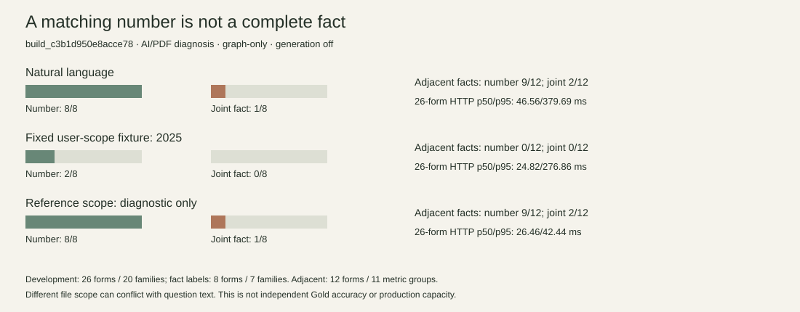
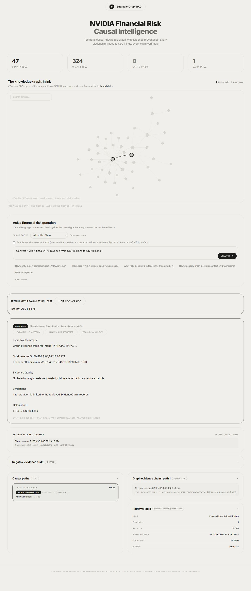

# 最新真实服务的有效性验证：数字相同，还不够

本轮停止在一次冻结的验证交付：不扩展功能，不修复新验证题后反复刷分。所有结果属于 **AI 对照 PDF 诊断**，人工单审、独立复核与裁决均未执行。没有生产部署或独立 Gold 准确率结论。

## 1. 版本与数据身份

| 对象 | 重新核实的身份 | 数据／用途 |
|---|---|---|
| 用户原工作区 | `9270c3bff269e67e0eea80788be7139379390ea7` | configs、tmp、历史文档与用户未提交材料未动 |
| 本轮服务代码／PR #1 开始基线 | `14c7458f1ad3199a48ed2f0f1865802fe3ea94ff` | 隔离 checkout；不是用旧主工作区代码验证新结果 |
| 当前候选 | `build_c3b1d950e8acce78` | 3 PDF、395 页、843 向量块；187 accepted triples → 324 fact edges；233 typed observations |
| 当前真实数据库 | 本机隔离 Neo4j `bolt://127.0.0.1:17689`，database `neo4j` | state_20261002_repair1；来源哈希、完整观察、节点与边构建身份由 preflight 核验 |
| 当前向量身份 | `isolated_build_c3b1d950e8acce78` | 从不可变包复制到新的可写运行目录；不直接打开原包 |
| 协议 | [protocol.json](protocol.json)，`service-validity/v1` | 三个输入条件分别运行；图模式、生成关闭、查询缓存关闭、最多 10 路径 |
| 标签版本 | [冻结输入哈希](frozen_inputs_sha256.json) | [8 条开发完整事实](development_fact_labels.json)；[12 条相邻事实](validation_fact_labels.json) |
| 本轮运行 | `run-three-modes-v2` | 每模式 26 个开发形式＋12 个相邻事实＝38 请求；三模式共 114 请求 |
| 修复前候选 | `build_c69e08565d907662` | 198 triples、362 edges、271 observations；错误 PASS 保留在旧公开原始记录 |
| 历史六方法候选 | `build_7feb21b48e594a7a` | 不用最新 HTTP 数字覆盖其检索结果 |

候选包是本机保留的不可变包，不是 GitHub 中公开分发的数据库二进制。构建身份内的 git_commit 是构建时父提交 `546f1f20…`，不能写成发布提交。绑定服务代码的是源码 SHA-256 `1bd675377637941c937015c2e12e7fe0432b983667b4b1a7b489799fa96cf8ab`；新运行的 preflight 再次匹配该指纹。

## 2. 三种输入条件，不混合成绩

自然语言模式仅发送问题与固定传输参数，不注入文件、年份、指标、证据或答案。查询计划从问题本身识别年份和文件不属于参考注入。原始请求、实际计划、有效文件范围、路径证据、计算和引用全部保留。

用户范围模式采用预先固定的 **2025 文件选择测试输入**，并非声称用户实际逐题选过文件；不从参考答案挑选“正确文件”。与问题中 2023／2024 文件要求冲突时，失败属于这个条件的范围约束，不能据此判定自然语言模式变差。

参考范围诊断使用旧数据 candidate_filing 或新源标签文件，是上限诊断，不计为独立自然语言成绩。

以下各行构建均为 `build_c3b1d950e8acce78`，审核等级均为 AI/PDF；开发集 26 形式／20 家族，其中完整事实评分 8 形式／7 家族。相邻集 12 形式／11 个指标组，部分指标与旧开发家族重叠，因此不是完全开发外独立家族测试。

| 输入模式／题集 | HTTP 成功 | 数值正确 | 必要字段联合正确 | 已判断直接页命中 | 问题／家族数 |
|---|---:|---:|---:|---:|---:|
| 自然语言／开发 | 26/26 | 8/8 | 1/8 | 13/23 | 26/20 |
| 自然语言／相邻事实 | 12/12 | 9/12 | 2/12 | 10/12 | 12/11 指标组 |
| 用户固定 2025 范围／开发 | 26/26 | 2/8 | 0/8 | 2/23 | 26/20 |
| 用户固定 2025 范围／相邻事实 | 12/12 | 0/12 | 0/12 | 1/12 | 12/11 指标组 |
| 参考范围诊断／开发 | 26/26 | 8/8 | 1/8 | 13/23 | 26/20 |
| 参考范围诊断／相邻事实 | 12/12 | 9/12 | 2/12 | 10/12 | 12/11 指标组 |

数字相等不能绕过公司、指标、币种与尺度、期间、披露、具体报表类型、片段支持和证据位置检查。开发自然语言条件中，公司、指标、单位、期间、披露均 8/8；报表类型只有 1/8。其余七条输出笼统 `FINANCIAL_STATEMENTS`，不能代替资产负债表、损益表或附注。完整字段分母及未判断项见 [summary-release.json](summary-release.json)，并且全请求与成功执行子集分母均可重算（本轮三模式全部 HTTP 200，二者相同，不意味着全答案正确）。



## 3. 引用 14/25 与直接页 13/23 的关系

旧助手把所有 relevance grade > 0 都计作“支持页”，包含 2 个只有背景标签的问题。当前同一历史记录重算：**13/23 直接页命中＋1/2 背景问题命中＝14/25 任意正标签页命中**；另一个问题无页标签。不是“14 个完整事实正确”，也不是全语料召回率。

修复前同口径为 11/23 直接页＋1/2 背景＝12/25。旧六方法的 23 个已判断直接问题是相同开发标签口径，但路径检索结果与 HTTP 最终引用不是同一证据粒度，不能直接比较成提升。

直接页使用 grade ≥ 2，背景使用 grade = 1；没有标签的引用页列作未判断，不能直接负标。完整事实 scorer 另外连接 evidence_id、实际路径片段、原文行语义锚点与数值，防止“页面命中但片段没答案”。这仍是源核查的自动诊断，不是人工语义蕴含评分。physical_page 字段是已判断原文位置匹配，**不是浏览器成功定位率**。

## 4. 原始失败 → 根因 → 修复 → 同条件复测

| 历史错误 PASS | 区别与已有修复 | 同条件结果 |
|---|---|---|
| FY2022 研发费用返回 7,434 | 7,434 是总营业费用；原 PDF 2023 p.43 研发是 5,268。已有修复分开 R_AND_D_EXPENSE 与 OPERATING_COST，排除股份薪酬附注组成项误归属 | 5,268，数值与单位正确；特定 MD&A 语境联合评分通过 |
| FY2022 应收余额返回 -2,215 | 2023 p.58 是现金流期间变动；p.56 期末净余额是 4,650。已有修复区分现金流变动与净余额 | 4,650 数值正确；具体报表类型仍过于笼统，联合失败 |

旧数值结果 6/8 → 8/8 的两个变化来自以上修复。旧错误响应没有删除。本轮保留应用代码与候选不变，没有把再次读到的失败题用于调参。

新诊断还发现：

- V11 问现金流应收调整 **-2,215**，系统反向返回余额 **4,650，PASS**；余额修复不代表两个方向都泛化成功。
- V12 问 Data Center 收入 **115,186**，返回公司总收入 **130,497，PASS**；组成项问题不能退化为总额。
- V03 问应付账款余额，返回 AMBIGUOUS；属于规划覆盖不足，不是正确数值答案。
- [边界补充试验](boundary-probes/requests.jsonl)：两道百分比原文参考（2023 p.43 的 19.6% 与 9.1%）在自然语言与参考范围下均 OPERATION_UNSUPPORTED；不能把有证据的已披露百分比自动当作可完成的比例计算。
- Q01 问 FY2024 Q4，返回全年 **60,922，PASS**。尚无独立季度数值标签，季度数值准确率不评分；但回答观察的 FY2024 年度期间不符合 Q4，这是明确的期间契约失败。固定 2025 范围时该题拒答。

补充三个问题分别三模式执行，共 9 次 HTTP 200；不混入前述 114 请求成绩。两个百分比参考的数值与联合均每模式 0/2。季度题不被默认正确。所有新诊断仅低证据等级 AI/PDF；不宣称论文充分样本量。

评分器版本审计：summary.json 是初版；summary-v2.json 修正既有本体 `SG_AND_A_EXPENSE` 的语义同义名称映射；summary-final.json 进一步把未判断位置从自动负例改为未判断。**未改变参考值、来源、单位、容差或应用代码**。这属于评估实现纠错，原版本全部保留；最终可重算版本为 summary-release.json。相邻联合由初版 1/12 变为 2/12 来自同义名称纠错，不是系统质量提升。

金额容差固定为原文整数百万的半单位；百万转十亿为 0.0005；一位小数百分比为 0.05 个百分点。没有按预测误差调节。关系、比较、条件风险、歧义和不可答的审核规则在协议内；18 个开发形式缺完整语义标签，保持 UNSCORED，不能算 18 个正确。

## 5. 速度和资源：只描述实际测量范围

新试验逐条件重启 HTTP 进程，数据库预热，系统文件缓存未控制；没有查询结果缓存，无生成。自然语言 26 个开发形式 p50/p95 **46.5585 / 379.689 ms**；12 个相邻事实 **20.909 / 233.717 ms**。不同题型不同质量，不能与旧向量嵌入检索宣称直接加速。

自然语言 HTTP 进程树在请求后采样最大 RSS **165,318,656 bytes**，不是瞬时峰值，也不含 Neo4j、前端、OS 或构建资源。硬件、另外两种条件与启动时间均在各模式 resources.json 中。没有承诺生产 SLO，没有长时压力或稳定性结论；LLM 生成实际关闭，费用和嵌入阶段耗时未单独计量，不填零费用。

历史 c3b 短时并发 1/2/4 各 10/10 的 p50 为 20.961 / 18.341 / 23.355 ms，保留在 [原始短时试验](../project-closure-2026-09-30/trial-20261002-bounded-benchmark/resources.json)。另两轮被限流的 429 保留；短时请求成功不能等同计算容量。旧六方法矩阵仍只属于 build_7feb21b48e594a7a，本轮不重跑，不提出新图扩展优势结论。

## 6. 新候选浏览器与生命周期

[实际浏览器观察](browser-observations.json)与[完整计算页面](browser-calculation-full.png)属于当前 c3b，而非旧库存截图。浏览器输入单位换算问题，实际显示 **130.497 USD billions、PASS、原文片段与 p.80 链接**。点击打开原始 PDF URL，HTTP 校验源文件 hash 与页存在通过；但现存查看器实际显示第 2 页，重载后显示失败图标，工具不能进入 PDF 查看器 closed shadow root 控件。**正确物理页导航 NOT_VERIFIED**；不能根据 #page=80 直接称通过，亦不能在中断与复用查看器后断言应用是唯一原因。



[生命周期记录](lifecycle/lifecycle.json)：HTTP 首次启动五场景 5/5；停止 owned HTTP 进程并重启后五场景 5/5。错误 build_id preflight 拒绝；不可用 Bolt 依赖拒绝；恢复正确参数 preflight 通过。真实 Neo4j 从保留状态恢复且没有改写配置、凭证或数据。运行前后不可变包 PASS。

跨构建服务回滚没有执行：本轮未建立旧候选对应源码与可切换运行目标的完整验收链，未修改任何正式发布指针或用户旧数据库。HTTP 重启不是跨版本回滚；因此工程稳定候选门槛仍未满足。LLM 完整 readiness 返回 503，不把关闭生成的确定性成功写作 LLM 服务就绪。

## 7. 复现与文件核验

以下离线评分仅 Python 标准库即可；使用未存在的输出文件名：

```powershell
python deployment/test_complete_fact_scoring.py
python deployment/summarize_service_validity.py --root experiments/service-validity-2026-10-02 --output recomputed-validity.json
python deployment/verify_validity_artifacts.py --root experiments/service-validity-2026-10-02 --recomputed recomputed-validity.json
python deployment/plot_service_validity.py --summary recomputed-validity.json --output recomputed-validity.svg
```

实际 HTTP 复跑需要匹配来源 PDF、immutable c3b 包、本机隔离 Neo4j 凭证文件和新可写运行目录。运行命令：

```powershell
python deployment/run_service_validity.py --candidate <immutable-c3b-package> --credentials <private-loopback-credentials.json> --inputs experiments/service-validity-2026-10-02 --dataset experiments/financial-evidence-qa-2026-09-28/financial_qa_dev_source_review_20260924_v3.jsonl --output <new-run-directory> --runtime <new-writable-runtime-directory>
```

不要公开凭证，不要把占位路径当成一键恢复数据库。run-three-modes/preflight.json 保留初次运行失败：旧运行副本没有所选 Chroma collection；创建新运行副本后 v2 全部通过，原包和旧副本未覆盖。公开产物逐项 SHA-256 见 public_manifest.json，Git attributes 保留字节不做换行改写。

## 8. 可以讲述的成果与不能宣称的结论

系统处理单公司多披露版本的可追溯财务事实：PDF 文档层与表格形成构建绑定的证据声明和类型化观察，Neo4j 投影携带数值与单位，结构化计划选取期间／披露，确定性计算连接原文引用。相较旧轮，本轮增加了不注入参考文件的真实查询、完整事实防误判评分、相邻指标失败和真实新候选计算界面。

图规模从 198/362 降为 187/324，是组件语义和总额语义被分开的库存变化，**可能**减少错误事实，而非越少越好；6/8 → 8/8 仅为已有开发数值回归证据，新现金流和 Data Center 失败说明正确性没有全面解决。

答辩或面试可以描述：构建身份隔离、来源可追溯、确定性计算契约、114 次分条件真实 HTTP 验证及失败分析；必须同时说明 AI/PDF 等级、8/8 数值但 1/8 完整事实、图扩展未建立优势。不可称独立准确率 100%、生产上线、用户规模、已发表论文、因果推断能力或全部由用户个人完成。

有证据支持的下一步最多三个：具体报表类型保真；年度／季度及余额／变动／组成项规划的安全拒答；在冻结独立语义家族上只检验一个“按题型选择是否扩图”的假设。后续修复须建立新候选、新记录和新的未用于修复验证家族，不能改写这一批结果。

**发布判定：可重算的受限实验验证材料，不是通过真实服务全部验收的工程稳定候选版。** 正确 PDF 导航、跨构建回滚、季度独立参考与完整独立语义家族验证不满足本轮全部目标；具体证据已记录，不以新增测试数量代替这些门槛。
